&nbsp;&nbsp;&nbsp;&nbsp;、

# =★= Debian-Pi-Aarch64 =★=

*The newest Raspberry Pi 64-bit OS 2.0 Release!!!*

## Official Documentation Version 2.0

***[中文版(Chinese)](README_zh.md)***

***English edition translation is continuously optimized and adjusted ...***


----

The newest **Raspberry Pi 64-bit OS**, **OPENFANS** open source community & Raspberry **Pi Fan** base community Co-Produced.

This is an **official version** readme for the newest version 2.0 of 64-bit OS which is support for the **full range** of 64-bit CPU Raspberry Pi such as **3B, 3B+, 3A+, 4B**.

**The passed system version: 1.0 and 2.0 preview has been without any updates or supported.**

The **"Old Readme"** was viewed **[here](./README_ORGI.md).** ( - Just A Chinese Edition)

**First, Please read this document carefully before your questions, maybe your answers have included in this document (We'll refuse to reply any answered questions).**

**Attention, please! Besides this document, any other documents in this Git repository are no longer supported (Except linked file form this document), just for a developer's archive.**

## Attention!

- All commands executed of this article, unless specified, are executed under the **root** privileges by default!!

- With any problems, be sure to upgrade your **system**, **firmware** and **kernel** to the **latest** version first. Click **[here](./README.md#5-update-and-upgrade)** to check the **latest version** and learned how to upgrade your **system**, **kernel** and **firmware**.

## Notice:

*The official version 2.0 is most suggested to upgrade to the latest firmware version:* **"2019-10-05"**

```
The latest version of the system:
2019-10-03-v2019-2.0-Release

The latest version of kernel and firmware:
2019-10-05-v2019-2.0-Release (recommended update)
```

## Donation

Thanks for your donation! We'll get the greatest power from your encourage!


----

## Contents

[0. System Screenshots](./README.md#0-system-screenshots)

----

[1. Introduction](./README.md#1-introduction)

[1-1. System Environment (Versions)](./README.md#1-1-system-environment-versions)

[1-2. System Environment (Base Env)](./README.md#1-2-system-environment-base-env)

[1-3. Features Comparison From Different Versions](./README.md#1-3-features-comparison-from-different-versions)

[1-4. Some System Performance Testing Results](./README.md#1-4-some-system-performance-testing-results)

----

[2. Main features Introduction](./README.md#2-main-features-introduction)

[2-1. Web Visual Management Interface](./README.md#2-1-web-visual-management-interface)

[2-2. QEMU-KVM Virtualization Support](./README.md#2-2-qemu-kvm-virtualization-support)

[2-3. Docker Container Support](./README.md#2-3-docker-container-support)

[2-4. AUFS File System Support](./README.md#2-4-aufs-file-system-support)

[2-5. TCP Acceleration](./README.md#2-5-tcp-acceleration)

[2-6. Memory And Swap Optimization (Algorithm-level)](./README.md#2-6-memory-and-swap-optimization-algorithm-level)

[2-7. macOS-Mojave Theme Desktop](./README.md#2-7-macos-mojave-theme-desktop)

[2-8. CecOS-CaaS Container Cloud (JUST A CHINESE EDITION SUPPORT)](./README.md#2-8-cecos-caas-container-cloud-just-a-chinese-edition-support)

[2-9. Other Features](./README.md#2-9-other-features)

----

[3. Instructions For Usage](./README.md#3-instructions-for-usage)

[3-1. System Initialization (First Boot)](./README.md#3-1-system-initialization-first-boot)

[3-2. Accounts And Passwords](./README.md#3-2-accounts-and-passwords)

[3-3. Web Login Interface NOTE](./README.md#3-3-web-login-interface-note)

[3-4. Pre-Configured Items](./README.md#3-4-pre-configured-items)

[3-5. Wireless Configuration](./README.md#3-5-wireless-configuration)

[3-6. Wired Network Configuration](./README.md#3-6-wired-network-configuration)

[3-7. Boot Custom Startup Script](./README.md#3-7-boot-custom-startup-script)

[3-8. DO NOT Upgrade The Deepin Desktop ENV](./README.md#3-8-do-not-upgrade-the-deepin-desktop-env)

[3-9. TTY Display Chinese Font (Not Remote) Of Chinese Environment](./README.md#3-9-tty-display-chinese-font-not-remote-of-chinese-environment)

[3-10. Install VNC Remote Desktop Of macOS Mojave Theme Desktop Environment](./README.md#3-10-install-vnc-remote-desktop-of-macos-mojave-theme-desktop-environment)

[3-11. Switch Sound Output Channels](./README.md#3-11-switch-sound-output-channels)

[3-12. 32-Bit Software Armhf Support](./README.md#3-12-32-bit-software-armhf-support)

[3-13. Enabled And Start Docker Service](./README.md#3-13-enabled-and-start-docker-service)

[3-14 Enabled And Start CecOS CaaS Container Cloud](./README.md#3-14-enabled-and-start-cecos-caas-container-cloud)

[3-15 Create And Joined Or Exit And Left A Docker Cluster](./README.md#3-15-create-and-joined-or-exit-and-left-a-docker-cluster)

[3-16. FAQ NOTE](./README.md#3-16-faq-note)

[- 3-16.1 Using Profiles To Connect To The Wireless Networks Of Graphical Desktop Environment](./README.md#3-161-using-profiles-to-connect-to-the-wireless-networks-of-graphical-desktop-environment)

----

[4. Virtual Machine Instructions](./README.md#4-virtual-machine-instructions)

[4-1. Standard Virtual Machines PKG Instruction](./README.md#4-1-standard-virtual-machines-pkg-instruction)

[4-2 BT-Panel Virtual Machine PKG Instruction](./README.md#4-2-bt-panel-virtual-machine-pkg-instruction)

[4-3 How To Expand The Size Of A Virtual Machine Disk](./README.md#4-3-how-to-expand-the-size-of-a-virtual-machine-disk)

----

[5. Update And Upgrade](./README.md#5-update-and-upgrade)

[5-1 Upgrade System](./README.md#5-1-upgrade-system)

[5-2 Update Kernel And Firmware](./README.md#5-2-update-kernel-and-firmware)

[5-3 Update Instruction](./README.md#5-3-update-instruction)

[5-4 Latest Current Version](./README.md#5-4-latest-current-version)

----

[6. Download Links](./README.md#6-download-links)

----

[7. Other Instructions](./README.md#7-other-instructions)

[7-1 Donation](./README.md#7-1-donation)

[7-2 Contact Info.](./README.md#7-2-contact-info)

[7-3 Copyright](./README.md#7-3-copyright)

----

[8. Join US!](./README.md#8-join-us)

----


# Official Documentation Version 2.0

----

## 0. System Screenshots

Screenshot of the macOS-Mojave theme desktop by XFCE.

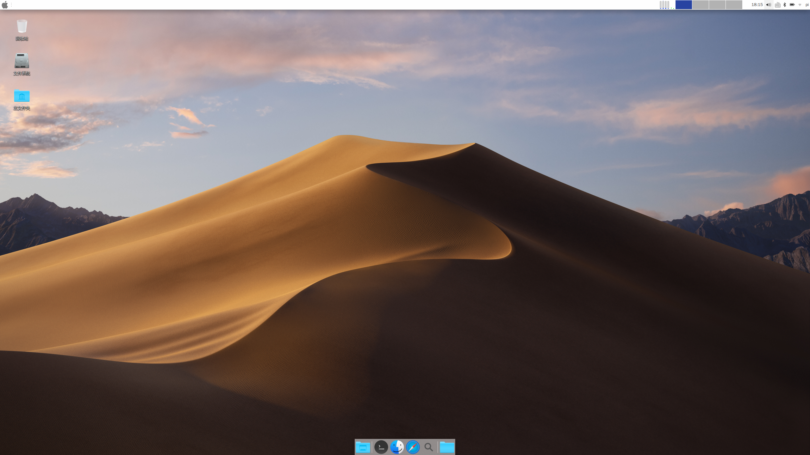

Screenshot of the BaseOS Plus++ version: Web Management login interface.

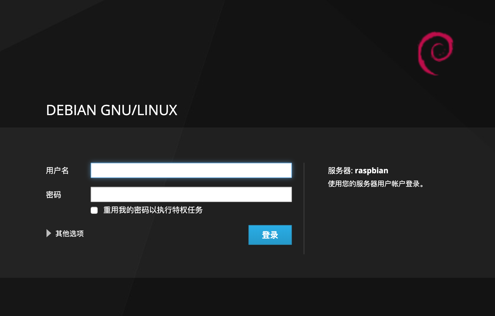

Screenshot of the BaseOS Plus++ version: Web Management system info interface.

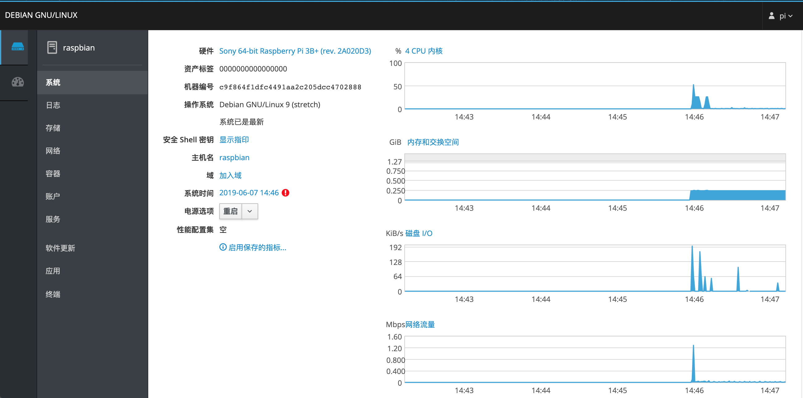

Screenshot of the BaseOS Plus++ version: Web Management container interface.

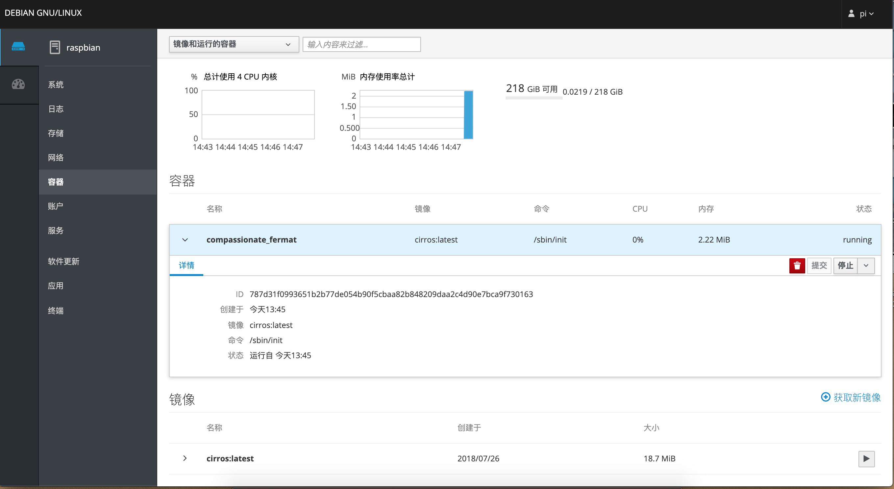

Screenshot of the BaseOS Plus++ version: Web Management web console interface.

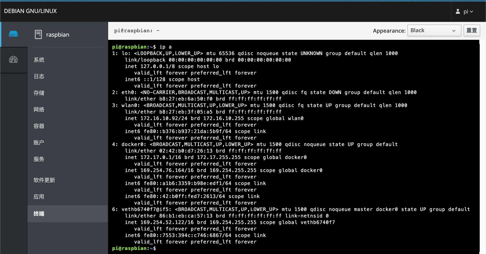

Screenshot of the CecOS CaaS Container Cloud: Main page.

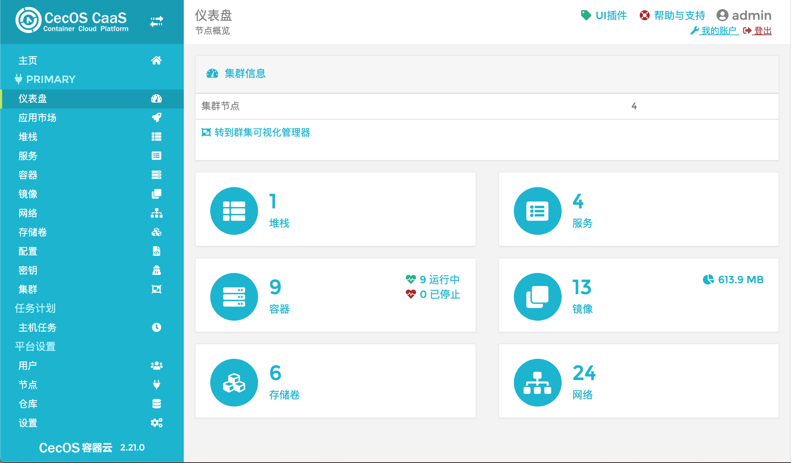

Screenshot of the CecOS CaaS Container Cloud: Cluster Management.

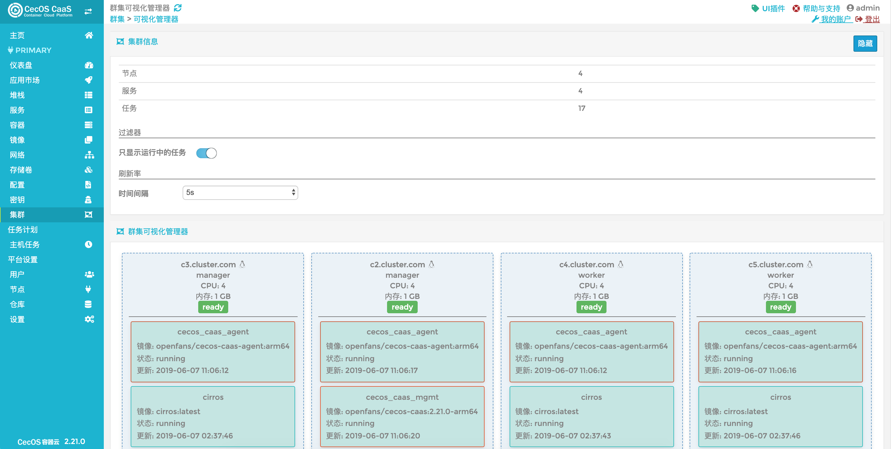

Screenshot of the macOS-Mojave theme desktop: Multimedia support.

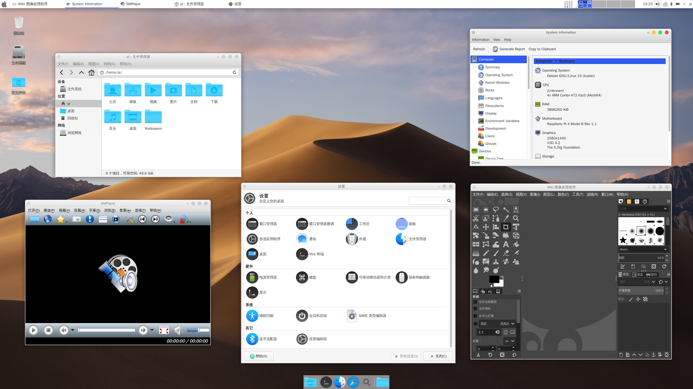

Screenshot of the Deepin desktop environment: Main Desktop.

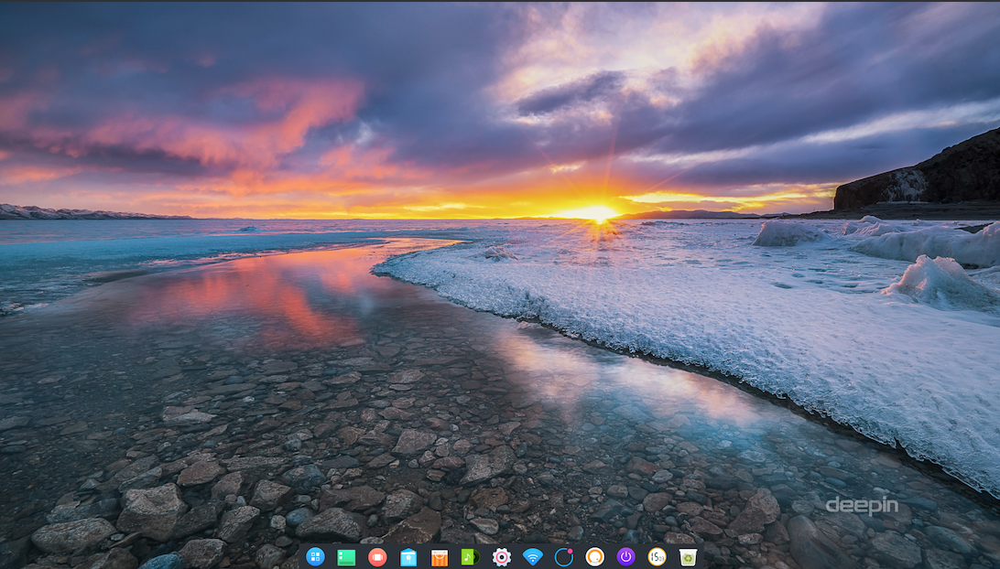

Screenshot of the Deepin desktop environment: Dashboard.

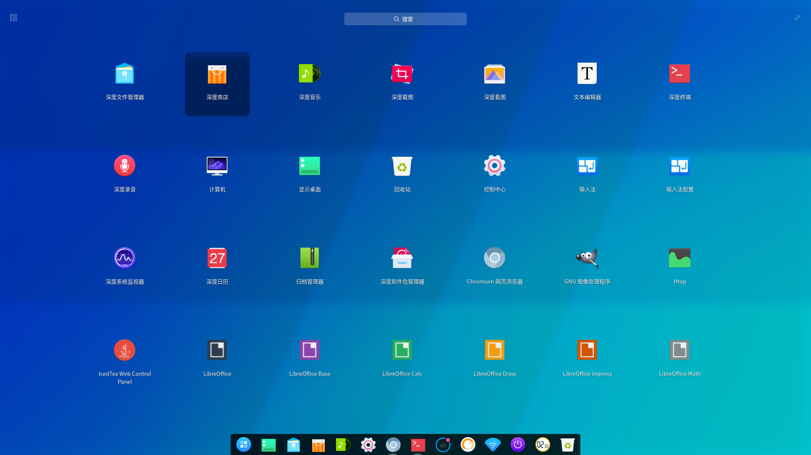

Screenshot of the Deepin desktop environment: System Settings & System info.

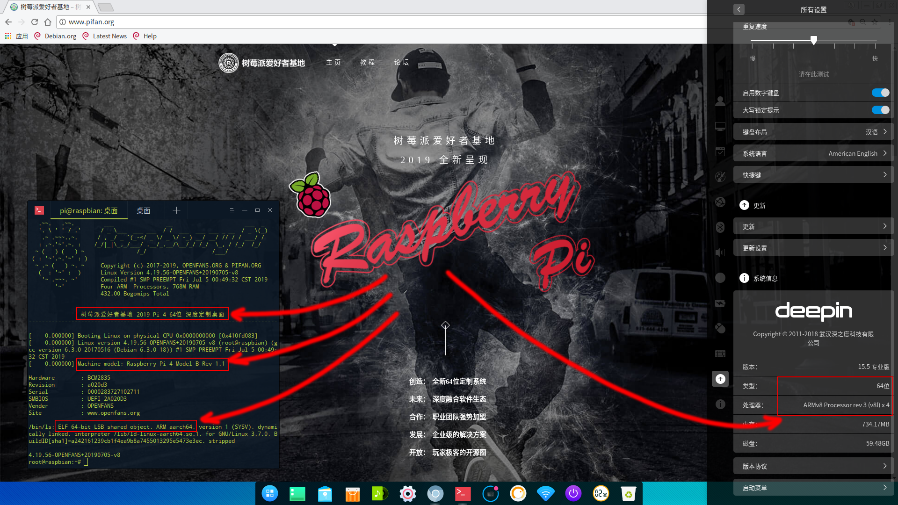

Screenshot of the macOS-Mojave Theme Desktop: Graphics Virtual Machine Manager (VMM). 

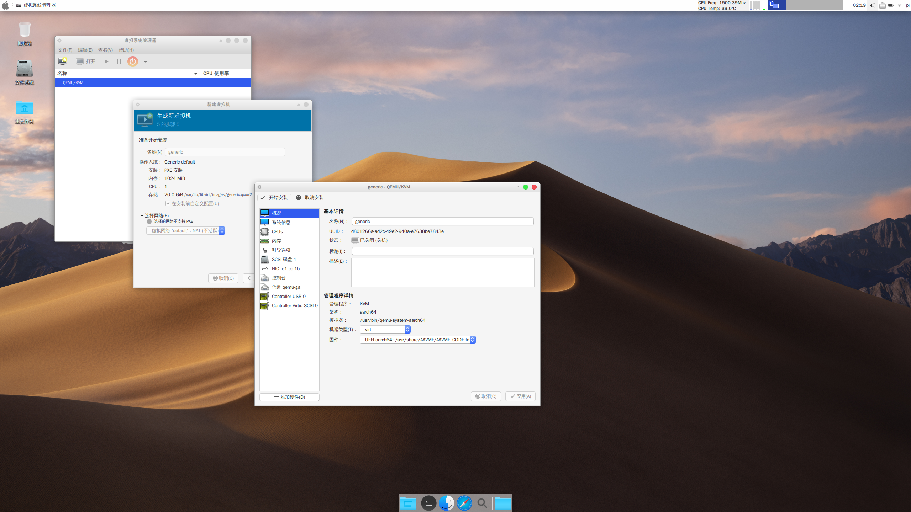

Screenshot of the macOS-Mojave Theme Desktop: Run Android App: DOTA.


Screenshot of the macOS-Mojave Themed Desktop: Run Android App: WPS (A China office compatible software) and DOTA.

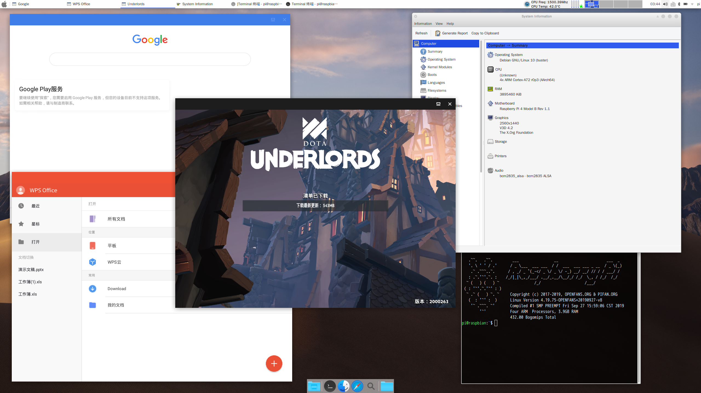

----

## 1. Introduction

Don't ask a question about using a 64-bit OS for the Raspberry Pi and what's the difference between 64-bit & 32-bit OS?

Cuz the Raspberry Pi with a 64-bit CPU, unfortunately the Raspberry Pi foundation had without any system or software supported. Otherwise please add your brain...

All the versions released in this article are official versions that had been used and validated in the real enterprise production environment. The system has been rigorously tested and used normally with fully compatible for the Raspberry Pi 3B/3B+/3A+/4B, such as local wired, wireless network card, Bluetooth, 3D acceleration, etc. The numbers of all system packages are almost comparable to the X86 version. The system was built from the official Debian 64-bit baseline (wasn't built from any other ported edition or third-part edition) to ensure the original flavor.

There isn't any other relationship with the official Raspberry Pi, so no proprietary commands as the Raspberry Pi official system used (such as raspi-config, rpi-update, etc.), you need to edit the configuration file ( /boot/config.txt ) by yourself.

**Why choose Debian?**

Cuz the Raspberry Pi has the best compatible from Debian OS (This is inseparable from Raspbian does, the Raspbian is also based on Debian OS with the full-testing, also inherited a great power and performance of Debian. For example: Ubuntu, the most famous and successful distribution OS which was also based built from Debian).

This system is completely different from any systems we released before (also including the previous 64-bit Debian we published), we have all built from zero-os baseline this time and built a new automatic compilation and packaging, the testing system in our lab. We also redefined the packaging process and adjust all the relevant configurations, make a lot of modifications, adjustments and optimizations for the system, fixed a lot of bugs of the kernel. A lot of new features have been added, especially with the support for the hardware KVM virtualization acceleration and optimization for Docker features tuning.

**We have specifically redefined and optimized our own cross compiler chain-tool and compiler for rebuild the base kernel and modules of Raspberry Pi when we were publishing the version 2.0 what is more greatly optimized and improved compiler faster and efficiency (About cross compiler chain-tool and compiler, you can refer to Huawei's Ark compiler, they have the same effect, our compiler is optimized for basic compilation tools such as C, C++, G++, ASM, NM, ld, CMAKE, and Glib, etc., Specifically target the raspberry-based hardware, ARM aarch64 A53 and ARM-v8a A72 and also including instruction set of hardware, etc.)**

On June 20, 2019, the Raspberry Pi foundation released the new fourth-generation single-board machine "Raspberry Pi 4B". We got the 4th-generation 4G version from the Raspberry Pi official Cambridge Global Store for the first time.

- **On July 6, 2019, half a month hard-working after Pi4 released, The OPENFANS and the Pi Fan base community released the new Debian-Pi-Aarch64 OS version 2.0 release together.**

- **This is the world's 64-bit OS which is first support to Raspberry Pi 4B !!**

All of the new version 2.0 has 3D acceleration supported (With FKMS), and finally introduced the **OPENFANS Container Cloud Management Platform**  supported (Also called CecOS CaaS, based build from an open-source project which is called Portainer) which is be more perfect and powerful than system version 1.0!

The newest OS 2.0 is also adhering to the all excellent tradition from the Debian-Pi-Aarch64 OS which was built by OPENFANS and Pi Fan Base community.

This newest OS 2.0 is full support to all Raspberry Pi aarch64 single boards: 3B, 3B+, 3A+, 4B, and still inherit all the features of the stable version 1.0!

----

### 1-1. System Environment (Versions)

● **BaseOS** (none desktop environment, basic version)

```
Standard underlying system basic image, none x-window environment.
**System image name format: OPENFANS-Debian-Buster-Aarch64-XXXXXX.img
```

● **BaseOS Plus++** (none desktop environment, plus++ version)

```
Out of the function of BaseOS, with a visual Web UI management interface added.
**System image name format: OPENFANS-Debian-Buster-Aarch64-XXXXXX-plus.img
```

● **macOS Mojave theme custom desktop** (Desktop environment, Full-Featured)

```
Exclusive system image ingested from the XFCE depth-customized 
and full support all the features as our other versions!
**System image name format: OPENFANS-Debian-Buster-Desktop-Aarch64-XXXXXX.img
```

● **Deepin desktop environment**

```
Based on our own underlying BaseOS system image, from the complete 
Deepin 15.5 Pro desktop environment is ported, which is the first 64-bit ARM64 image currently built 
based on the complete Debian Aarch64 architecture, adapted to the Raspberry Pi 3B, 3B+, 3A+ and 4B.
**System image name format: OPENFANS-Deepin-Professional-Desktop-Aarch64-XXXXXX.img
```

● **Kernel** & **Firmware** Upgrade Package

```
General naming rules are in the form of (starting with the upkg ) :
upkg-xxxx (years)-xx (months) -xx (day) -vxxxx-x-x-zip/zip.xz
```

----

### 1-2. System Environment (Base Env)

All the version 2.0 system images are used "ext4" file system as default, the Tsinghua source-mirror was set as the default software repo, and version was based on the Debian Buster 10 Arm64.

**Note that version 2.0 does not support upgrades from any other version for the time being and requires a fresh installation.**

### 1-3. Features Comparison From Different Versions

|Projects|BaseOS|BaseOS Plus++|Desktop Full-Featured|Deepin Desktop|
|---|---|---|---|---|
| KVM Hardware Virtualization Support|★|★|★|★|
|Graphical Virtual Machine Manager|X|X|★|X|
|Docker Container|☆|★|☆|☆|
|CecOS CaaS Platform|☆|★|☆|X|
|WebGUI Manager|X|★|★|X|
|Web SSH Client|★|★|★|★|
|Standard VM kit|★|★|★|X|
|BT-Panel kit|★|★|★|X|

**Note:**

**★ :** Stands for supported and default enabled. It can directly be used.

**☆ :** Stands for supported and default disabled. Need to be started manually. 

(There will be an instruction for how to use this service in this document.)

**X :** Stands for not supported.

----

### 1-4. Some System Performance Testing Results

#### Version 1.0 vs. other comparable 64-bit OS (developed by others) testing result

An incomplete testing result, just theoretical data, for reference only:

UnixBench testing results using the Ext4 Standard File System and The Raspberry Pi 3B Plus (compared to comparable Debian Aarch64 systems):

* **Single Thread:**


* **Multi-threaded:**


* **Overall rating:**


Overall performance comprehensively exceeds the comparison test system of 2 to 3 times, some indicators even reached more than 10 times, 1000% improvement.

- Version 1.0 vs. Raspberry Pi Official 32-bit system testing result

Recently, the Raspberry Pi official has done a lot of optimization work, the current system compared to the previous 32-bit system has a larger improvement, but limited to the 32-bit local architecture restrictions, and 64-bit system performance gap is still large.

**Attached:** Pi Fan **Debian Pi Aarch64 64-bit version 1.0 system vs. Raspbian 32-bit** performance comparison testing result

*Sysbench 0.4.12 Result:*

| **Test projects** | **ARM32/EXT4** | **ARM64/F2FS** | test unit：**time** / the **smaller** the better |
| --- | --- | --- | --- |
| **System Information** | 2018-11-13-Raspbian | Raspberry Pi Fan 64-bit U8 Edition | Increase the multiple |
| **The CPU single thread** | 119.2072 | 9.8725 | 12.07 |
| **The four-threaded** | 299.5217 | 24.6616 | 12.15 |
| **the eight-threaded** | 299.5824 | 24.6789 | 12.14 |
| **Memory Random** | 1.2625 | 0.8751 | 1.44 |
| **Memory Continuous** | 1.5803 | 1.1583 | 1.36 |
| **Continuous read-write of files** | 6.1621 | 2.2928 | 2.69 |
| **File Random Reading and Writing** | 484.812 | 6.3527 | **76.32** |

Maximum Performance Gap Multiple: **76.32**

Multiples of the average performance gap: **14.95**

- Version 1.0 testing result comparison chart

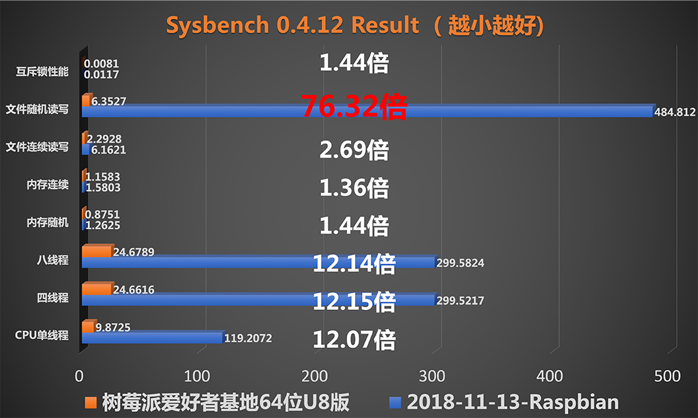

#### The latest 2.0 beta with The Raspberry Pi Official 32-bit System Testing Result

Test hardware: Raspberry Pi 4B

*Sysbench 0.4.12 Result:*

| **Test projects** | **ARM32/EXT4** | **ARM64/EXT4** | test unit：**time** / the **smaller** the better |
| --- | --- | --- | --- |
| **The system** | 2019-06-20 raspbian-buster | 2019-07-06 Pi Fan 2.0 Beta Edition | Increase the multiple |
| **Single-threaded** | 92.7292 | 6.7406 | 13.757 |
| **The four-threaded** | 231.6591 | 16.8172 | 13.775 |
| **the eight-threade** | 231.5002 | 16.8282 | 13.757 |
| **Memory Random** | 2.4225 | 0.6086 | 3.980 |
| **Memory Continuous** | 2.5631 | 0.9267 | 2.766 |
| **Continuous read-write of files** | 6.3636 | 1.8859 | 3.374 |
| **File Random Reading and Writing** | 627.719 | 10.6036 | 59.199 |
| **Mutually exclusive lock performance (4096)** | 0.0206 | 0.0081 | 2.543 |

Maximum Performance Gap Multiple: *59.199*

Average Performance Gap Multiple: *14.144*

- Version 2.0 testing result comparison chart (statistical unit: time, the smaller the better)

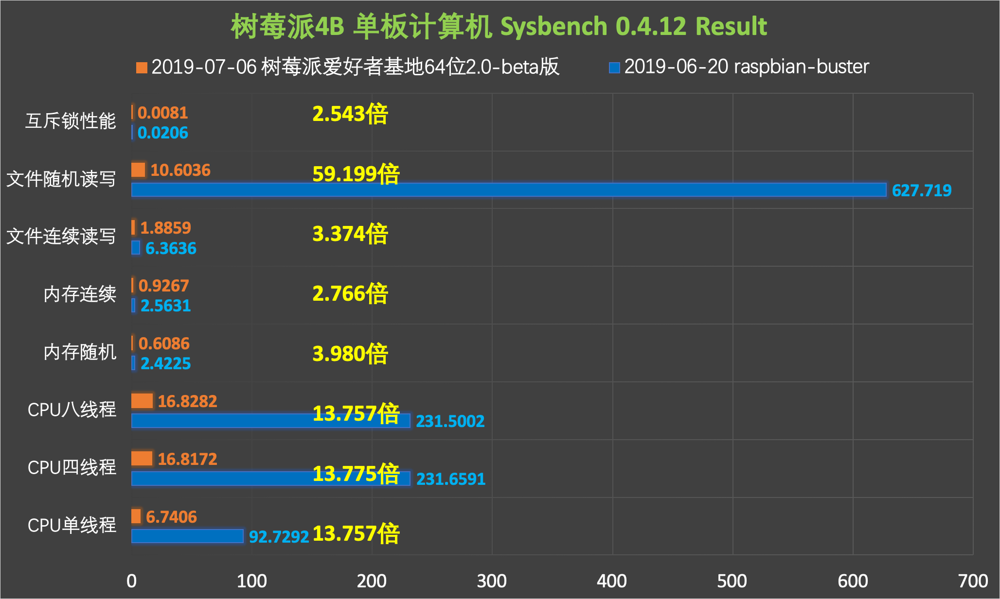

----

## 2. Main Features Introduction

### 2-1. Web Visual Management Interface


All-platform web visual management interface (Only supported for BaseOS and Desktop Full-Featured version).

With web management interface support on the new 64-bit OS version 2.0, the system-wide platform enables visual operational management interface, whether it's standard desktop graphics or desktop-free systems (enhanced version), the Debian-Pi-Aarch64 officially opens the visual era.

Web management interface support:

```
1. New Full-featured version of support;

2. Fully open the web management era, save the trouble of terminal tools, 
Anytime, Anywhere, direct browser management;

3. Enabled docker container service by default, out-of-the-box 
(version 2.0 please manage and use containers via CecOS CaaS Container Cloud);

4. Full-service monitoring of integrated Web interface;

5. Support the web interface to view system conditions, 
hardware information, situation and other information;

6. Support for web interface setting hostname;

7. Support for web interface setting up host domain;

8. Support web interface to set host time, NTP servers, update mode;

9. Support web interface shutdown and restart the system;

10. Support for web interface system log management;

11. Support web interface system storage and related peripheral management, 
online partitioning, mount equipment, and other functions;

13. Support for web interface system account management;

14. support for web interface system service management;

15. Support for web interface system update management;

16. Web interface integrates shell terminal, which can be operated directly on the web page;

17. Support for cross-node and unified management: manage multiple devices in one interface, 
dramatically improving management and productivity;

18. Web management communications are encrypted using SSL certificates to ensure the security 
of session data.
```

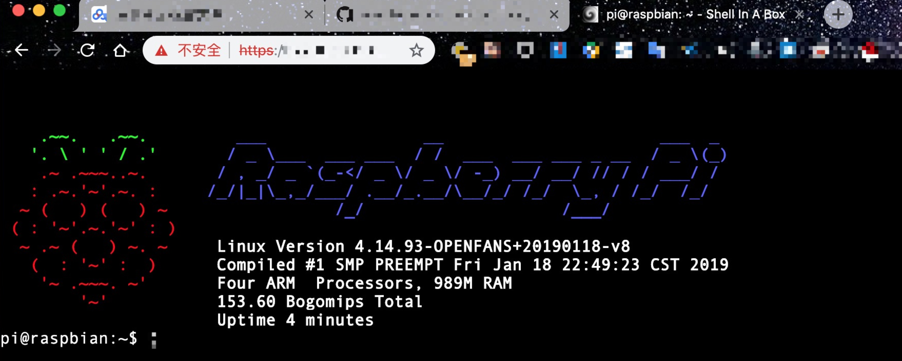

**WEB SSH** client support, using a separate web shell (shellinaBox) suite, provides separate **web ssh** login support.

### 2-2. QEMU-KVM Virtualization Support

This is a QEMU virtual machine with local Aarch64 architecture that supports KVM hardware acceleration.

We recompiled KVM binary to address many of the bugs for **qemu-system-aarch64** in KVM hardware-accelerated environments:

The default version of the system virtual machine cannot run, the system cannot be installed, etc. After KVM hardware acceleration was turned on...

We added support for KVM virtual machines when compiling the kernel, directly supporting full virtualization of hardware-accelerated, and added support for local KVM virtual hardware kernel modules, the main kernel modules are as follows:

```
1. virtio //standard virtual disk

2. virtio-scsi //virtual scsi disk

3. virtio-blk //pass-through disk block device

4. Virtio-blk-scsi //pass-through disk block device scsi mode

5. virtio-net //virtio virtual network card

6. virtio-balloon //memory bubble

7. virtio-hw-random //virtual random number hardware

8. virtio-console //virtual terminal

9. virtio-input //virtual input device

10. Virtio-crypto-device //virtual encryption device

12. virtio-drm-gpu //virtual graphics

13. Virtio-9p //directory Sharing with v9p

14. vfio //Pass-through device support

15. vhost //host data interaction

16. vhost-net //host network data interaction

...
```

**What is KSM?**

The principle of KSM is that in multiple processes, Linux merges kernel-like memory pages into one memory page.

This feature, which is used by KVM to reduce memory usage of multiple similar virtual machines, improves memory efficiency. Cuz memory is shared, so multiple virtual machines use less memory, which is more effective when using the same image and operating system for virtual machines. To better optimize the memory efficiency of virtual machines, the kernels of all our systems support KSM by default.

The current 2.0 system is fully available for virtualization support by default, and the graphical desktop provides a visual "**Virt-Manager**" app for management.

### 2-3. Docker Container Support

The famous Docker will not be much introduced here, this time we recompile the kernel, added the full feature of Docker support, this is currently the most complete support for Docker features under the Raspberry Pi Aarch64 system architecture, Most other versions are still 32-bit systems with 32-bit dockers, and local 64-bit system cores lack much kernel support for Docker features.

Even the latest version of the famous 32-bit Raspberry Pi Docker system **Hypriot** doesn't fully support the **Docker Swarm**.

You'll get the following error message because the **Hypriot** does not support the **bridge vlan/vxlan netfiler**:

```
reexec to set bridge default vlan failed exit status 1
```

This will result in the complete use of the Docker Swarm cluster is not support (The Hypriot OS), the lack of relevant feature support for the network, there will be some functional missing problems.

You can find a lot of errors and warnings on the local 64-bit ARM system by using the **systemctl status containerd** and the **systemctl status docker** as well as by viewing the logs, and not counting them completely. The local system kernel includes at least lost the following features: (The Hypriot OS and most other system)

```
1. cgroup memory limit

2. cgroup swap limit

3. cgroup rt period

4. cgroup rt runtime

5. cgroup pid support

6. cgroup memory sysfs

7. cgroup rdma

8. cgroup perf

9. cgroup bridge vlan/vxlan

10. cgroup netfiler

11. cgroup net prio

12. cgroup cfs bandwidth limit

13. Bridge vlan ilter

14. ipvs

15. ipvs ipv6

16. memory sysfs

17. Kernel KSM

...
```

**Docker Compose**

Docker official doesn't provide arm/arm64 based docker-compose to run binary, so we recompiled and provided aarch64-bit binary that can be run and now the default is added to the system images, which you can use directly.

### 2-4. AUFS File System Support

**What is the AUFS File System?**

AUFS, the full name is an advanced multi-layered unification file system, the main function is to combine the contents of multiple folders to provide a unified view, mainly for the various Linux distributions livecd, and the docker inside used to organize the images.

AUFS was Docker's default storage driver, with a very stable, lots of real deployments, and strong community-supported, with several key advantages:

```
- Very short container start-up time
- Effective storage utilization
- Effective memory utilization
```

But since it is not included in the Linux kernel mainline, many Linux distributions do not support AUFS.

The latest Docker defaults to the faster and latest OverlayFS file system, we make maintains the default value for this official setting.

**Do we need to use AUFS?**

Cuz Docker's mirror files use a file system that is divided into multiple tiers, OverlayFS supports only 2 tiers, multiple replicas are replicated when using the same mirror layer, and takes up more space and I/O, while a AUFS also provides the ability to use multi-tiered storage and share data. Docker uses AUFS' Copy-on-Write copy technology to achieve image sharing and minimize disk space usage.

For devices with less storage space like Raspberry Pi, using the AUFS file system makes better use of our limited storage space resources and reduces I/O consumption.

To allow users to freely choose and use OverlayFS or AUFS according to their circumstances, we have added support for AUFS modules by default in the kernel.

Since AUFS is not supported by the mainline of Linux kernel, we have added AUFS kernel module code and recompiled to the kernel of mainline 4.19 through AUFS' PATH, and now the system boot will automatically load the AUFS module, which can be used directly without human intervention.

### 2-5. TCP Acceleration

The kernel has turned on the TCP BBR congestion control algorithm by default.

**What is TCP BBR?**

Let's explain simply what the TCP BBR solves:

```
- Make full use of bandwidth on network links with a certain drop rate, 
ideal for high-latency, high-bandwidth network links;

- Reduces buffer occupancy on network links, reducing latency, 
making it ideal for users who access the network at slow speed.
```

Simply put, the TCP BBR congestion control algorithm can improve TCP transmission speed and efficiency to a certain extent and optimize network transmission.

**How to turn off:**

Edit the "/mnt/etc/sysctl.conf" file, execute the command "**sysctl -p**" to view the results, and do not see the following comments, representing the operation succeeded.

Comment out the following 2 lines: (Just put the "**#**" at the beginning of each line)

```
net.core.default-qdisc-fq
net.ipv4.tcp.tcp-contents-control-bbr
```

### 2-6. Memory And Swap Optimization (Algorithm-level)

- **Support: Swap Partition**

This new version of the system by default increased support for swap  caches to alleviate the problem of low memory in the system, greatly improved support and efficiency of executable large-capacity memory requirements applications, users do not need to manually create the system Swap, our system will automatically complete and initialize Swap after installation. The location of the Swap file or partition can be adjusted by looking at the system mount profile **/etc/fstab** .

- **Support: zSWAP virtual memory compression**

This new version of the system kernel by default has added the virtual memory compression function of the "zSWAP" to provide a compressed writeback cache for the pages to be swapped, the default limit of physical memory is the 25%  of system's total memory upper limited.

**Why zSWAP?**

When the memory page is about to be swapped out, zSWAP does not move it to the switching device, but compresses it and then stores it in a pool of memory that is dynamically allocated within the system RAM, and the act of writing back to the actual swap device is delayed or even avoided altogether, thus significantly reducing the I/O used by the Linux system for switching. For Raspberry Pi such a device relying on the TF card, the original I/O is not very high, reducing the operation of I/O for exchange means improving system performance, I/O used in system applications and other more needed scheduling.

In scenarios where swap files/partitions are used, TF life can be increased by reducing I/O operation on Swap files/partitions.

**zSWAP** does not virtual a block device, but hook into the ordinary Swap code, before the actual *write-to-disk/read* operation, the first use of their management of memory for data swap/in, memory is not enough to use before the use of traditional Swap files/partitions. So zSWAP is suitable for systems that already have swap partitions themselves, as well as hardware devices like Raspberry Pi, which have little memory of itself.

**Why not zRAM?**

zSWAP uses both memory and swap partitions, and automatically adjusts the size of the memory, and the cached data is automatically stored into the Swap file/partition when the system memory is not enough, greatly improving the efficiency of the system Swap swap exchange. More full use of memory space resources and avoid the system memory shortage, and zRam completely use memory to operate and store data, completely occupied memory, generally used in large memory scenarios, which is not appropriate for a small memory Raspberry Pi.

**zSWAP memory allocators and data compression algorithms used in this system :**

```
Memory allocator zpool frame: smalloc, zbud, z3fold
```

The reality shows that although zsmalloc has a high compression rate, the algorithm is complex and requires additional threads to be responsible for memory finishing, which consumes more cpu time.

The zbud implementation is simple, memory page storage does not produce memory fragmentation, but the compression rate is low, up to only 2 times, does not meet the actual needs of small memory system.

As a result, Sony developed the z3fold memory allocator, which is exactly the same as zbud's implementation, except that each page can store 3 compressed pages, with a maximum compression rate of 3 x, and a nearly 4x of zsmalloc, a technique used in xperia xzp, Get a 4GB experience with your 4GB phone.

We selected the z3fold algorithm in the system, and we can see the configuration in the system /boot/cmdline.txt:

```
zswap.enabled=1 zswap.zpool=z3fold zswap.compressor=lz4 zswap.max_pool_percent=25
```

**Compression algorithm**

Linux has many compression algorithms: lz, lzo, xz, gzip, lzma...

We have adopted **lz4** with very high compression speed and high compression rate, **lz4** compared to other compression algorithms, compression rate is not the highest, but the speed is indeed the fastest, in the case of the z3fold algorithm has been used, combined with the Raspbery Pi's performance characteristics and actual testing, and also wanna get a good compression rate, Speed is the most important thing for the Raspberry Pi (given its CPU performance overhead and memory size).

### 2-7. macOS-Mojave Theme Desktop


The default desktop theme uses a desktop that mimics the macOS Mojave theme.

### 2-8. CecOS-CaaS Container Cloud (JUST A CHINESE EDITION SUPPORT)


Rebuild from An open-source project [Portainer](http://potainer.net) and develop for Chinese and others By OPENFANS.

### 2-9. Other Features

- Support for 3D acceleration, all desktop environments are enabled by default.

- There are too many new features of version 2.0, we won't elaborate anymore here.

----

## 3. Instructions For Usage

### 3-1. System Initialization (First Boot)

The system will automatically expand the root partition, and then automatically configure, until complete, the normal use, in the process the system will automatically restart **3** times.

### 3-2. Accounts And Passwords

System default account: **pi**, default password: **raspberry**

The default account pi account supports ssh login, for root account password please login first and then use the command **"sudo passwd root"** to set,

Or use the command **"sudo -i"** to switch to the root user mode.

### 3-3. Web Login Interface NOTE

```
1.Web Visual Management Login Interface
Login address https://yourRasp's IP address:9090
Description: Please login system used default account: pi

2.WEB SSH Client Portal Login Interface
Login address https://yourRasp's IP address:4200
Description: Used the account with the permission of console login, 
user pi was already with this permission.
```

### 3-4. Pre-Configured Items

The system provides a pre-configured network and auto-start task during boot, with the path and correspondence of the relevant profile as follows:

| Pre-configured items | Pre-profile paths | Corresponding to the system file path to the link |
| --- | --- | --- |
| Wireless Networks | /boot/wpa_supplicant.conf | /etc/wpa_supplicant/wpa_supplicant.conf |
| Wired Networks | /boot/interfaces | /etc/network/interfaces |
| DHCP Clients | /boot/dhclient.conf | /etc/dhcp/dhclient.conf |
| Custom Boot Scripts | /boot/rc-local | /etc/rc.local |

### 3-5. Wireless Configuration

A desktop environment can be set up through a graphical interface after logging into the desktop environment, here provides how the configuration file is modified.

If the desktop environment wants to connect to wireless networks using a configuration-modifying approach, please NOTE [here](./README.md#3161%E5%9B%BE%E5%BD%A2%E5%8C%96%E6%A1%8C%E9%9D%A2%E7%8E%AF%E5%A2%83%E4%BD%BF%E7%94%A8%E9%85%8D%E7%BD%AE%E6%96%87%E4%BB%B6%E8%BF%9E%E6%8E%A5%E6%97%A0%E7%BA%BF%E7%BD%91%E7%BB%9C).

Modify the file **"/boot/wpa_supplicant.conf"**

```
## To use this file,you need to run the command: ##
## "systemctl disable network-manager" and reboot system.##
##
## (Do not uncomment this line!) ##

## 'country' is to set wifi area,'CN' is china ##
#country=CN
#ctrl_interface=DIR=/var/run/wpa_supplicant GROUP=netdev
#update_config=1

## The following "WIFI 1", "WIFI 2" represents the settings of multiple wireless networks ##
## Unless you want to set up multiple wireless networks, ##
##you only need to set the settings of "WIFI 1". ##
## WIFI 1 (Do not uncomment this line!) ##

## In addition to canceling the content comments that need to take effect, ##
## the following only need to modify the contents of the quotes after "ssid" and "psk". ##
## ssid is your wireless Wifi name, psk is your wireless Wifi password ##
#network={
#    ssid="your-wifi1-ssid"
#    psk="wifi1-password"
#    priority=1
#    id_str="wifi-1"
#}

## WIFI 2 (Do not uncomment this line!) ##

#network={
#    ssid="your-wifi2-ssid"
#    psk="wifi2-password"
#    priority=2
#    id_str="wifi-2"
#}
```

**wireless area code settings**

Edit the file of the **"/etc/default/crda"**, edit the contents behind **"REGDOMAIN="**, the default has been set to "**CN**" China, in general, no settings are required.

**with wireless common area code: **

```
AU Australia
CA Canada
CN China
GB UK
HK Hong Kong
JP Japan
KR Korea
DE Germany
US USA
TW Taiwan
```

### 3-6. Wired Network Configuration

Modifying the file of the file of the file: **"/boot/interfaces"**

```
interfaces (5) file used by by ifup (8) and ifdown (8)
Include files from /etc/network/interfaces.d:
source-source/etc/network/interfaces.d
Used dhcp ip address set eth0 inet to dhcp,
sor used static ip address set eth0 to static
Sand change other ip settings.
If you wanna let settings to take effect,
suncomment symbol in front.
#auto eth0
#allow-hotplug eth0
#iface eth0 inet dhcp
#iface eth0 inet static
#address 172.16.192.168
#netmask 255.255.255.0
#gateway 172.16.192.1
#dns-nameservers 8.8.8.8
```

### 3-7. Boot Custom Startup Script

The system supports a custom scripts as an auto-start task during boot, which can be pre-configured before the system starts.

Edit the script file **"/boot/rc-local"** and add the custom script content before line: **"exit 0"**.

### 3-8. DO NOT Upgrade The Deepin Desktop ENV

Cuz of compatibility issues with the Deepin system and upstream warehouses (deepin itself), it is strongly discouraged from using any of the following commands or any other operations that would cause the system to be upgraded unless you know what you need to do!!!

All Deepin version systems need attention, including all Deepin versions of 1.0 and 2.0!

```
apt upgrade
apt-get upgrade
apt dist-upgrade
apt-get dist-upgrade
```

**PS:**

*Some software installation limited to Deepin itself compatibility issues, there may be bug caused the system can not start or any other unknown problems, because the software is too much we can not test one by one, welcome feedback, recommended install through source code.*

*The Deepin Software Store software is provided by Deepin, not us, at present, Depth Software Store does not provide software support for arm64 , if there is any needs, please go to the deepin official forum for assistance.*

*So we strongly recommend using our customized macOS-Mojave themed desktop version.*

### 3-9. TTY Display Chinese Font (Not Remote) Of Chinese Environment

Notice: Remote login ignores this problem, there will be no garbled problem. When only using the local terminal through a local monitor or serial connection, because the Linux kernel local standard TTY does not support the display of Chinese font, the relevant of action when the display of garbled is required.

We need to install fbterm extension support, to do that, use following commands under network environment:

```
## Install fbterm
sudo apt update; sudo apt install fbterm -y

## Add a login user to the video group
sudo adduser root video ; sudo adduser pi video

sudo adduser you create your own other user name (if any) video

## And then execute the following command each time you need to display Chinese fonts
## (wait some time for the first time):

fbterm
```

### 3-10. Install VNC Remote Desktop Of macOS Mojave Theme Desktop Environment

Install RealVNC

```
dpkg --add-architecture armhf ; apt update
cd ~/ ; wget https://www.realvnc.com/download/file/vnc.files/VNC-Server-6.6.0-Linux-ARM.deb
apt install ./VNC-Server-6.6.0-Linux-ARM.deb
rm -rf ./VNC-Server-6.6.0-Linux-ARM.deb
dpkg --remove-architecture armhf ; apt update
systemctl enable vncserver-x11-serviced.service ; systemctl start vncserver-x11-serviced.service
```

Click [here](https://www.realvnc.com/en/connect/download/viewer/) to download RealVNC client

Install and run the client, enter the IP address directly, do not need to fill in the port, username, and password is your system's login user and password.

PS:

*Some advanced instructions for Realvnc:*

```
Installed system unit for VNC Server in Service Mode Mode Daemon
Start or stop service with:
  systemctl (start-stop) vncserver-x11-service.service

Mark or unmark the service to be started at boot time with:
  systemctl (enable-disable) vncserver-x11-service.service

Installed system unit for VNC Server in Virtual Mode Daemon
Start or stop service with:
  systemctl (start-stop) vncserver-virtuald.service
Mark or unmark the service to be started at boot time with:
  systemctl (enable-disable) vncserver-virtuald.service

Kill All Process:
killall vncserver-x11-core vncserver-x11 vncagent vncserverui
```

### 3-11. Switch Sound Output Channels

Vesrion 2.0: System Default Use the **HDMI** to output audio.

The commands for switching the sound output:

```
amixer cset numid s 3 2

## Set the output here to 2, which is HDMI.
## Setting the output to 1 switch to the analog signal (that is, the headphone connector).
## The default setting is 0, which represents automatic selection.
```

### 3-12. 32-Bit Software Armhf Support

```
dpkg --add-architecture armhf
apt update

## The 32-bit "libc6:armhf" base library needs to be installed first
apt install libc6:armhf

apt install [Other package name]:[armhf]

## Install 32-bit software Please add suffix ":armhf" after the name of the package
```

### 3-13. Enabled And Start Docker Service

The **BaseOS** and **Desktop Full-Features Versions** are not enabled by default and require manual start-up.

```
## Turn on the Docker service automatically start
systemctl enable docker.service

## Start Docker service
systemctl start docker.service

######

## Stop Docker services
systemctl stop docker.service

## Disable Docker service from booting
systemctl disable docker.service
```

### 3-14 Enabled And Start CecOS CaaS Container Cloud

The **BaseOS** and **Desktop Full-Features Versions** are not enabled by default and require manual start-up.

**Note: To enable the CecOS CaaS container cloud service, you must enable and start the docker service first!**

```
## Turn on the CecOS CaaS Container Cloud service automatically start
systemctl enable cecos-caas.service

## Start CecOS CaaS Container Cloud service
systemctl start cecos-caas.service

######

## Stop CecOS CaaS Container Cloud service
systemctl stop cecos-caas.service

## Disable CecOS CaaS Container Cloud service from booting
systemctl disable cecos-caas.service
```

### 3-15 Create And Joined Or Exit And Left A Docker Cluster

```
## Initialize and join a Docker Swarm Cluster
docker swarm init

## View cluster node status
docker node ls

## exit Docker Swarm Cluster
docker swarm leave -force
```

### 3-16. FAQ NOTE

#### 3-16.1 Using Profiles To Connect To The Wireless Networks Of Graphical Desktop Environment

The graphical desktop environment uses a profile to connect to a wireless network, and after modifying the ** /boot/wpa_supplicant.conf** file, to ensure good network compatibility, do the following:

with root user identity:

```Shell
systemctl network Manager
```

Then execute:

```Shell
sed -i  \
's/sudo systemctl restart NetworkManager/## sudo systemctl restart NetworkManager/g' \
/home/pi/.xsessionrc
```

Finally, after restart all done.

----

## 4. Virtual Machine Instructions

Virtual machine resource packages are typically published as compression packages, and the following commands are performed to install the support for the unzip pack:

```
apt update ; apt install tar gzip zip unzip bzip2 xz-utils -y
```

### 4-1. Standard Virtual Machines PKG Instruction

Default user: root (remote permissions turned on), password: raspberry

After unzipping the virtual machine resource package, change location and into the virtual machine's resource package directory then unzip the virtual disk image:

```
xz -d -k disk.qcow2.xz
```

You will get a virtual disk image of **disk.qcow2**, and the system can be restored at any time with the commands above.

**Run the virtual machine:**

```
sudo ./vm-run

## This script command above will run the virtual machine in a background manner by default.
```

Run the virtual machine in the way the previous station:

Copy the file **vm_run** and name as **vm_run2** , open the file **vm_run2** and delete the following 2 lines:

```
... ## omitting content
nohup \
... ## omitting content
   &
... ## omitting content
```

Then, run **"sudo ./vm_run2"**.

**Remote login:**

Port 22 of the virtual machine has been mapped by default to the local port 2222, SSH access to the local machine's port 2222 directly.

Example of the command:

```
ssh -p 2222 root@local-ip-address
```
----
### 4-2 BT-Panel Virtual Machine PKG Instruction

In order to take care of new users and respond to the voices of the people, we finally “integrated” the Pagoda for you, using the virtual machine, 32-bit super clean custom ARMHF virtual system optimized for the pagoda, even for virtual machines, The speed is also greatly stronger than the official backplane system (who has used and who will understand :) --).

To run the benchmark:

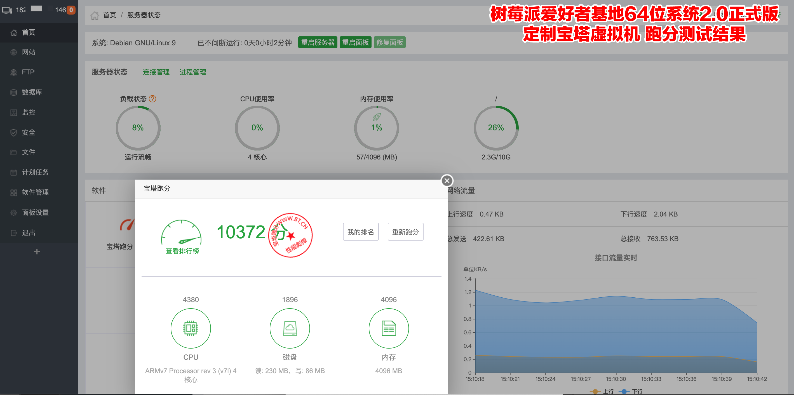

By default, all software is installed. Version 5.9.X Relatively stable professional "learning version", you know, this is just only allowed to use for your testing!!

**Why BT-Panel?**

```
1. The use of beginners is convenient;
2. The voice of the masses is too high;
3. By the way...
```

**Why not integrate directly in the 64-bit OS?**

```
1. Not everyone needs a default integration, too bloated;

2. Pollute system;

3. BT-Panel is extremely poorly compatible with ARM64!

4. The BT-Panel is not just a simple installation. 
The software that needs to be used in the ARM system almost all needs to be recompiled. 
The compatibility is poor and it takes a long time. 
It can pretend that you doubt life and pretend that you wanna cry.

5. The problems of various strange pits encountered in our use;

6. It is not that the BT-Panel is not good overall. 
At least the compatibility on the ARM64 is a considerable problem. 
It feels like the official has not done the test. 
All the work just like do the testing for them by free.
```

**Instructions:**

As with the standard virtual machine, extract the compressed package, and then change location and into the virtual machine's directory to perform related operations.

**installation:**

```
sudo ./install
```

**Start BT-Panel Virtual Machine:**

```
./bt_run
```

**Close the BT-Panel Virtual Machine:**

To ensure the data synchronization security of the virtual machine, please follow the steps below:

```
Please ssh login to the virtual machine and execute the command "init 0" 
to shut down the virtual machine.

After shutting down, you need to execute the " ./bt_prog " command in the 
BT-Panel virtual machine directory 
to check if the virtual machine is closed.

If there is no output, it means the virtual machine has been shut down normally.

If the virtual machine cannot be shut down gracefully, 
execute the " ./bt_prog kill " command in the BT-Panel virtual machine directory.

Also remember to execute the " ./bt_prog " command again to check 
if the virtual machine is down.
```

**Automatic startup:**

```
## Enable boot auto start
./install int

## Cancel the boot automatically
./install uint
```

**Default parameter value:**

|Project|Content|
|---|---|
|Default Management Port|28888|
|Default Management Address|http://IP-Address-of-your-Raspberry-Pi:28888/|
|Default Web Management User and Password|openfans/openfans|
|BT-Panel Virtual Machine SSH Port|2222|
|BT-Panel virtual machine root default password|rapberry|

**How to use ssh to connect to BT-Panel virtual machine?**

```
Local connection: ssh -p 2222 root@localhost
External connection: ssh -p 2222 root@IP-address-of-your-Raspberry-Pi
```

**NOTE:**

```
Do not modify the default management port of the BT-Panel Panel unless you know how to modify the 
install the deployment script.

If you need to enable site support for custom ports, edit the ports file to add your custom port, 
but don't modify the other default ports in the ports file.
```

**To save and save everyone's time, all the functions of the BT-Panel are turned on by default.**

**For better performance, we strongly recommend turning off or removing features you don't need.**

----

### 4-3 How To Expand The Size Of A Virtual Machine Disk

First, make sure your virtual machine was shutdown or not running.

The virtual machine disk in this article uses **bt.qcow2.disk** as an example.

#### 4-3.1. Disk expansion

**View disk size**

Excuting an order:

```shell
qemu-img info bt.qcow2.disk
```

Get the following information:

```shell
Image: bt.qcow2.disk
File format: qcow2
Virtual size: 10G (10737418240 bytes) # Total disk size
Disk size: 6.4 # used capacity
Cluster_size: 65536
Format specific information:
    Compat: 1.1
    Lazy refcounts: false
    Refcount bits: 16
    Corrupt: false
```

**Disk expansion**

In this case, our goal is to add 10G capacity to the virtual machine disk.

Execute the following command:

```shell
qemu-img resize bt.qcow2.disk +10G
```

Then look at the disk size again

Excuting an order:

```shell
qemu-img info bt.qcow2.disk
```

The results are as follows:

```shell
Image: bt.qcow2.disk
File format: qcow2
Virtual size: 20G (21474836480 bytes) # Capacity increase is successful, the total size is 20G
Disk size: 6.4G
Cluster_size: 65536
Format specific information:
    Compat: 1.1
    Lazy refcounts: false
    Refcount bits: 16
    Corrupt: false
```

#### 4-3.2. Extended partition

**Expanding increased capacity to system partition**

First, start the virtual machine and login to the virtual machine.

```shell
ssh -p 2222 root@localhost
```

**View disk size**

Excuting an order:

```shell
fdisk -l /dev/sda
```

The results are as follows:

```shell
Disk /dev/sda: 20 GiB, 21474836480 bytes, 41943040 sectors # has been added to 20G
Units: sectors of 1 * 512 = 512 bytes
Sector size (logical/physical): 512 bytes / 512 bytes
I/O size (minimum/optimal): 512 bytes / 512 bytes
Disklabel type: dos
Disk identifier: 0xcd0e4df1

Device Boot Start End Sectors Size Id Type
/dev/sda1 * 2048 20969471 20967424 10G 83 Linux # Partition capacity has not been expanded
```

**View partition size**

Excuting an order:

```shell
df -hT
```

The results are as follows:

```shell
Filesystem Type Size Used Avail Use% Mounted on
Udev devtmpfs 496M 0 496M 0% /dev
Tmpfs tmpfs 103M 1.5M 101M 2% /run
/dev/sda1 btrfs 10G 4.7G 4.7G 50% / # Partition capacity has not been expanded
Tmpfs tmpfs 513M 4.0K 513M 1% /dev/shm
Tmpfs tmpfs 5.0M 0 5.0M 0% /run/lock
Tmpfs tmpfs 513M 0 513M 0% /sys/fs/cgroup
Tmpfs tmpfs 103M 0 103M 0% /run/user/0
```

**Installation** *parted* **Disk Management Tool**

```shell
apt update ; apt install parted -y
```

**Extended partition**

Enter the following command: **parted** and follow these steps:

```shell
parted
```

At this point, you can see the disk information as follows

```shell
GNU Parted 3.2
Using /dev/sda # This is the disk we need to operate
Welcome to GNU Parted! Type 'help' to view a list of commands.
(parted) print # Enter "print" to view the disk information of the current operation
Model: QEMU QEMU HARDDISK (scsi)
Disk /dev/sda: 21.5GB # Total size has been increased to 20G
Sector size (logical/physical): 512B/512B
Partition Table: msdos
Disk Flags:
Number Start End Size Type File system Flags
 1 1049kB 10.7GB 10.7GB primary btrfs boot 
# Here "1" is the disk partition number, and the partition capacity has not changed yet.
```

Next enter the following command **resizepart** :

```shell
(parted) resizepart 
# Enter the command "resizepart" for partition expansion
Partition number? 1 
# Enter the partition number to be expanded. Since our disk here has only one partition, enter "1".
Warning: Partition /dev/sda1 is being used. Are you sure you want to continue?
Yes/No? yes # Confirm to continue, type "yes"
End? [10.7GB]? 100% 
# Enter "100%" to extend all available capacity to the partition specified in the previous step.
(parted) print 
# Enter "print" to view the disk information of the current operation
Model: QEMU QEMU HARDDISK (scsi)
Disk /dev/sda: 21.5GB
Sector size (logical/physical): 512B/512B
Partition Table: msdos
Disk Flags:
Number Start End Size Type File system Flags
 1 1049kB 21.5GB 21.5GB primary btrfs boot 
# You can see that the increased disk capacity has been expanded successfully.

(parted) quit # Enter "quit" to quit
Information: You may need to update /etc/fstab.
```

**Update Partition Table**

Execute the following command

```shell
partprobe /dev/sda
partprobe /dev/sda1
```

**Extended File System**

Our virtual machine here uses the *btrfs* file system. The related *btrfs* file system expansion operation is as follows:

Excuting an order

```shell
btrfs filesystem resize max /
```

Will get the following tips

```shell
resize '/' of 'max'
```

**Remount the partition**

This article extends the root partition **"/"**, so next we remount **"/"** root partition

Excuting an order:

```shell
mount -o remount,rw /
```

**Synchronous Data**

Excuting an order:

```shell
sync
```

**Validation results**

Check partition size

input the command

```shell
df -hT
```

The results are as follows:

```shell
Filesystem Type Size Used Avail Use% Mounted on
Udev devtmpfs 496M 0 496M 0% /dev
Tmpfs tmpfs 103M 1.5M 101M 2% /run
/dev/sda1 btrfs 20G 4.7G 15G 25% / # partition has been successfully expanded
Tmpfs tmpfs 513M 4.0K 513M 1% /dev/shm
Tmpfs tmpfs 5.0M 0 5.0M 0% /run/lock
Tmpfs tmpfs 513M 0 513M 0% /sys/fs/cgroup
Tmpfs tmpfs 103M 0 103M 0% /run/user/0
```

Restart the virtual machine, log in again, and execute the command **df -hT** to determine the result

----

## 5. Update And Upgrade

### 5-1 Upgrade System

For system updates, please use the tools or commands with the system, such as "apt update; apt upgrade"

**Due to Deepin compatibility issues, do not perform any system upgrades on Deepin Desktop!!**

### 5-2 Update Kernel And Firmware

Download the kernel and firmware update package, extract and go to the updated package directory, execute the following command:

```
cd ./upkg
sudo sh ./sys_upgrade
```

After the completion, restart it.

#### Note:

**Version 2.0 does not currently support upgrading from any other version and requires a new installation.**

### 5-3 Update Instruction

Click **[here](./update.md)** to see the update instructions.

### 5-4 Latest Current Version

Click **[here](./versions.md)** to view the latest current version information.

----

## 6. Download Links

- Baidu network disk: [Click to download](https://pan.baidu.com/s/1Q4eBVLyV9plXrjVGmSrMSg)

- OneDrive: [Click to download](https://1drv.ms/u/s!AtEthomfQXh8lWj8KVMcbJL0pgJL?e=tZHisM)

- Google Drive: [Click to download](https://drive.google.com/drive/folders/1MvMuzWYbjWSMZmY607qjukKiwSajOFZc?usp=sharing)

- HUAWEI OSS STORAGE: [View](https://pifan.obs.myhuaweicloud.com)

 (Because of space constraints, **OneDrive** does not currently provide virtual machine image template to download)

----

## 7. Other Instructions

### 7-1 Donation

#### Thanks for your donation! We'll get the greatest power from your encourage!

You can choose to scan Alipay for direct sponsorship to support us, and we guarantee that all donations will be used for project development and equipment purchase.


### 7-2 Contact Info.

Raspberry Pi Fan Base 64-bit OS special official community QQ group: **703626518**

Raspberry Pi Fan Base official website: **[www.pifan.org](http://www.pifan.org)**

Technology support documents official website: **[blog.pifan.org](http://blog.pifan.org)**

Raspberry Pi Fan Base official forum: **[bbs.pifan.org](http://bbs.pifan.org)**

OPENFANS official website: **[www.openfans.org](http://www.openfans.org)**

### 7-3 Copyright

```
1. The all above system is built by the OPENFANS open source community and is exclusively 
distributed and provided technical support by the Raspberry Pi Fan base community;

2. Any words or image reprint must indicate the source of the system (software); 
you can make any modifications to the software or system, but you must keep the source and readme;

Strictly used for any commercial purpose, if you need to use it commercially, 
please contact and obtain permission from OPENFANS open source community and 
Raspberry Pi Fan base community;

3. The above system and the ownership of the software belong to the corresponding software 
author and the license agreement to comply with the relevant software package;

4. Failure to comply with the appeal rules, the OPENFANS open source community and the 
Raspberry Pi Fan base community have the right to pursue their respective responsibilities 
and order to stop all infringements;

5. OPENFANS open source community and Raspberry Pi Fan base community have the final 
interpretation of the above content.
```

## 8. Join US!

The Raspberry Pi Fan base community is recruiting **volunteers** to join the community now. The basic requirements are as follows:

- **Hardware development and design staff**

```
1. Recognize the Raspberry Pi Fan base community culture and have great enthusiasm 
for the Raspberry Pi;
2. Responsible and responsible for the task of completing community arrangements on 
time and in quality;
3. Have the design ability of 3D printing modeling or circuit DSP;
4. Have practical hardware design experience.
```

- **Software and system developer**

```
1. Recognize the Raspberry Pi Fan base community culture and have great enthusiasm 
for the Raspberry Pi;
2. Responsible and responsible for the task of completing community arrangements on 
time and in quality;
3. Familiar with system build compilation or software development;
4. We like the development language, including but not limited to: JAVA, Python, 
Go, NodeJS, C, C++ ...;
5. Require software compilation and Deb packaging;
6. Have practical development experience.
```

**Another way, organizations, institutions and business units are welcome to discuss cooperation!!!**

Please contact us with any intent: **[admin@openfans.org](mailto:admin@openfans.org)**

Please write down the details and intentions and at least leave your **mobile phone number**, thank you for your cooperation.

----
