&nbsp;&nbsp;&nbsp;&nbsp;

# Debian-Pi-Aarch64 ★ 全新树莓派64位系统

# 2.0正式版 - 说明文档

***[English Edition (英文版)](./README.md)***  **... 请不要吝啬，一个点击，给我一颗心(Star), 已是莫大的荣耀。**  **:)**

*这是全球发行的第一个同时支持树莓派全系64位硬件的64位系统 !!!（包括：2Bv1.2，3B，3B+，3A+，4B）*

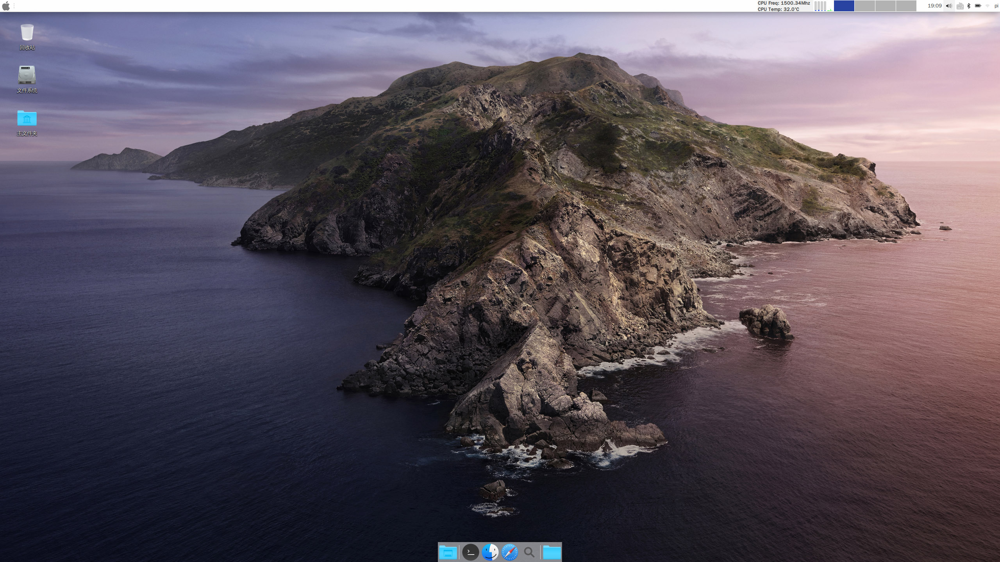

```
总有各类人群喷子千方百计找人把柄,为了避免误导,
我们对所有使用中、应用到的帮助、借鉴都会加以说明,如有遗漏，欢迎大家及时反馈给我们加上
再次致谢所有帮助过我们的人
```

----

\- **树莓派64位操作系统** - **OPENFANS开源社区 & 树莓派爱好者社区** - **联合出品** -

这是支持树莓派全系列64位CPU的全新的64位2.0系统 **正式版** 的说明文档，系统支持树莓派3B、3B+、3A+、4B。

**任何1.0版本及2.0预览版的历史系统版本目前已停止更新和维护，“历史说明文档” 请点击 [此处](./README_ORGI.md) 查看。**

**在使用前请仔细阅读该文档，避免重复提问或询问任何在该文档中已说明的内容（我们将拒绝回答任何已说明的问题）。**

**除本文档外本Git仓库中的其他任何文档已不再维护（本文链接的文档除外），仅作为开发人员存档，特此说明!!!**

**Gitee(码云)仓库地址**: [gitee.com/openfans-community/Debian-Pi-Aarch64](https://gitee.com/openfans-community/Debian-Pi-Aarch64)

**Github仓库地址**: [github.com/openfans-community-offical/Debian-Pi-Aarch64](https://github.com/openfans-community-offical/Debian-Pi-Aarch64)

## 注意

- 本文中所提到的执行的所有命令，没有特殊说明的情况下，默认都是在 **root** 用户的权限下执行！！

- 遇到任何问题的时候，请保证先将系统、固件及内核更新至**最新**版本，你可以点击 **[此处](./README_zh.md#5%E6%9B%B4%E6%96%B0%E5%8F%8A%E5%8D%87%E7%BA%A7)** 了解如何更新系统及升级内核和固件，以及查看最新的系统和**内核、固件**版本。

**快速友情提示:**

2.0正式版 强烈建议更新至 “**2019-12-30-2.0-U2**” 最新版固件, 最新 “2019-12-30-2.0-U2” 的系统不需要再更新固件。

```
系统最新版本：
2019-12-30-v2019-2.0-U2-Release

内核及固件最新版本：
2019-12-30-v2019-2.0-U2-Release ( 建议更新 )
```

2.0-U2将是整个2.0主线版本的最后一个主干发布版本。

在2020年，我们即将开启全新的2.X主干发行版本的支持计划，敬请期待！

*Focus on Edge computing and IoT core-net and hardware for the RPI ...*

## 赞助

感谢无私捐助我们的朋友们！你们的支持才是我们前进最大的动力！


----

## 目录

[0. 系统截图](./README_zh.md#0%E7%B3%BB%E7%BB%9F%E6%88%AA%E5%9B%BE)

----

[1. 系统介绍](./README_zh.md#1%E7%B3%BB%E7%BB%9F%E4%BB%8B%E7%BB%8D)

[1-1. 系统环境（版本介绍）](./README_zh.md#1-1%E7%B3%BB%E7%BB%9F%E7%8E%AF%E5%A2%83%E7%89%88%E6%9C%AC%E4%BB%8B%E7%BB%8D)

[1-2. 系统环境（系统相关）](./README_zh.md#1-2%E7%B3%BB%E7%BB%9F%E7%8E%AF%E5%A2%83%E7%B3%BB%E7%BB%9F%E7%9B%B8%E5%85%B3)

[1-3. 各版本功能比较](./README_zh.md#1-3%E5%90%84%E7%89%88%E6%9C%AC%E5%8A%9F%E8%83%BD%E6%AF%94%E8%BE%83)

[1-4. 部分系统性能测试结果](./README_zh.md#1-4%E9%83%A8%E5%88%86%E7%B3%BB%E7%BB%9F%E6%80%A7%E8%83%BD%E6%B5%8B%E8%AF%95%E7%BB%93%E6%9E%9C)

----

[2. 主要特性说明](./README_zh.md#2%E4%B8%BB%E8%A6%81%E7%89%B9%E6%80%A7%E8%AF%B4%E6%98%8E)

[2-1. Web可视化管理](./README_zh.md#2-1web%E5%8F%AF%E8%A7%86%E5%8C%96%E7%AE%A1%E7%90%86)

[2-2. QEMU-KVM 虚拟化支持](./README_zh.md#2-2qemu-kvm-%E8%99%9A%E6%8B%9F%E5%8C%96%E6%94%AF%E6%8C%81)

[2-3. Docker 容器支持](./README_zh.md#2-3docker-%E5%AE%B9%E5%99%A8%E6%94%AF%E6%8C%81)

[2-4. AUFS文件系统支持](./README_zh.md#2-4aufs%E6%96%87%E4%BB%B6%E7%B3%BB%E7%BB%9F%E6%94%AF%E6%8C%81)

[2-5. TCP加速](./README_zh.md#2-5tcp%E5%8A%A0%E9%80%9F)

[2-6. 内存及交换优化（算法级）](./README_zh.md#2-6%E5%86%85%E5%AD%98%E5%8F%8A%E4%BA%A4%E6%8D%A2%E4%BC%98%E5%8C%96%E7%AE%97%E6%B3%95%E7%BA%A7)

[2-7. MacOS Mojave 主题桌面](./README_zh.md#2-7macos_mojave%E4%B8%BB%E9%A2%98%E6%A1%8C%E9%9D%A2)

[2-8. CecOS CaaS 容器云](./README_zh.md#2-8cecos_caas%E5%AE%B9%E5%99%A8%E4%BA%91)

[2-9. 其他特性](./README_zh.md#2-9%E5%85%B6%E4%BB%96%E7%89%B9%E6%80%A7)

----

[3. 使用说明](./README_zh.md#3%E4%BD%BF%E7%94%A8%E8%AF%B4%E6%98%8E)

[3-1. 系统初始化说明](./README_zh.md#3-1%E7%B3%BB%E7%BB%9F%E5%88%9D%E5%A7%8B%E5%8C%96%E8%AF%B4%E6%98%8E)

[3-2. 账户及密码](./README_zh.md#3-2%E8%B4%A6%E6%88%B7%E5%8F%8A%E5%AF%86%E7%A0%81)

[3-3. Web登录接口说明](./README_zh.md#3-3web%E7%99%BB%E5%BD%95%E6%8E%A5%E5%8F%A3%E8%AF%B4%E6%98%8E)

[3-4. 预配置项](./README_zh.md#3-4%E9%A2%84%E9%85%8D%E7%BD%AE%E9%A1%B9)

[3-5. 无线配置说明](./README_zh.md#3-5%E6%97%A0%E7%BA%BF%E9%85%8D%E7%BD%AE%E8%AF%B4%E6%98%8E)

[3-6. 有线网络配置](./README_zh.md#3-6%E6%9C%89%E7%BA%BF%E7%BD%91%E7%BB%9C%E9%85%8D%E7%BD%AE)

[3-7. 开机自定义启动脚本](./README_zh.md#3-7%E5%BC%80%E6%9C%BA%E8%87%AA%E5%AE%9A%E4%B9%89%E5%90%AF%E5%8A%A8%E8%84%9A%E6%9C%AC)

[3-8. 深度桌面禁止自动升级的说明](./README_zh.md#3-8%E6%B7%B1%E5%BA%A6%E6%A1%8C%E9%9D%A2%E7%A6%81%E6%AD%A2%E8%87%AA%E5%8A%A8%E5%8D%87%E7%BA%A7%E7%9A%84%E8%AF%B4%E6%98%8E)

[3-9. 中文环境下TTY显示中文字体(非远程方式)](./README_zh.md#3-9%E4%B8%AD%E6%96%87%E7%8E%AF%E5%A2%83%E4%B8%8Btty%E6%98%BE%E7%A4%BA%E4%B8%AD%E6%96%87%E5%AD%97%E4%BD%93%E9%9D%9E%E8%BF%9C%E7%A8%8B%E6%96%B9%E5%BC%8F)

[3-10. macOS Mojave主题桌面支持Web界面VNC远程桌面访问](./README_zh.md#3-10macos-mojave%E4%B8%BB%E9%A2%98%E6%A1%8C%E9%9D%A2%E6%94%AF%E6%8C%81web%E7%95%8C%E9%9D%A2vnc%E8%BF%9C%E7%A8%8B%E6%A1%8C%E9%9D%A2%E8%AE%BF%E9%97%AE)

[3-11. 切换声音输出通道](./README_zh.md#3-11%E5%88%87%E6%8D%A2%E5%A3%B0%E9%9F%B3%E8%BE%93%E5%87%BA%E9%80%9A%E9%81%93)

[3-12. 32位软件armhf支持](./README_zh.md#3-1232%E4%BD%8D%E8%BD%AF%E4%BB%B6armhf%E6%94%AF%E6%8C%81)

[3-13. 启用和运行Docker服务](./README_zh.md#3-13%E5%90%AF%E7%94%A8%E5%92%8C%E8%BF%90%E8%A1%8Cdocker%E6%9C%8D%E5%8A%A1)

[3-14. 启用CecOS-CaaS容器云](./README_zh.md#3-14%E5%90%AF%E7%94%A8cecos-caas%E5%AE%B9%E5%99%A8%E4%BA%91)

[3-15. 启用和退出Docker集群](./README_zh.md#3-15%E5%90%AF%E7%94%A8%E5%92%8C%E9%80%80%E5%87%BAdocker%E9%9B%86%E7%BE%A4)

[3-16. FAQ常见问题说明](./README_zh.md#3-16faq%E5%B8%B8%E8%A7%81%E9%97%AE%E9%A2%98%E8%AF%B4%E6%98%8E)

[- 3-16.1 图形化桌面环境使用配置文件连接无线网络](./README_zh.md#3-161%E5%9B%BE%E5%BD%A2%E5%8C%96%E6%A1%8C%E9%9D%A2%E7%8E%AF%E5%A2%83%E4%BD%BF%E7%94%A8%E9%85%8D%E7%BD%AE%E6%96%87%E4%BB%B6%E8%BF%9E%E6%8E%A5%E6%97%A0%E7%BA%BF%E7%BD%91%E7%BB%9C)

[- 3-16.2 使用APT命令安装软件包时版本不匹配](./README_zh.md#3-162%E4%BD%BF%E7%94%A8apt%E5%91%BD%E4%BB%A4%E5%AE%89%E8%A3%85%E8%BD%AF%E4%BB%B6%E5%8C%85%E6%97%B6%E7%89%88%E6%9C%AC%E4%B8%8D%E5%8C%B9%E9%85%8D)

[3-17. 配套应用程序使用说明](./README_zh.md#3-17%E9%85%8D%E5%A5%97%E5%BA%94%E7%94%A8%E7%A8%8B%E5%BA%8F%E4%BD%BF%E7%94%A8%E8%AF%B4%E6%98%8E)

[- 3-17.1 WPS Office ARM64位 桌面版安装说明](./README_zh.md#3-171-wps-office-arm64%E4%BD%8D-%E6%A1%8C%E9%9D%A2%E7%89%88%E5%AE%89%E8%A3%85%E8%AF%B4%E6%98%8E)

[- 3-17.2 腾讯QQ官方Linux桌面版安装说明](./README_zh.md#3-172-%E8%85%BE%E8%AE%AFqq%E5%AE%98%E6%96%B9linux%E6%A1%8C%E9%9D%A2%E7%89%88%E5%AE%89%E8%A3%85%E8%AF%B4%E6%98%8E)

----

[4.虚拟机使用说明](./README_zh.md#4%E8%99%9A%E6%8B%9F%E6%9C%BA%E4%BD%BF%E7%94%A8%E8%AF%B4%E6%98%8E)

[4-1 标准虚拟机使用说明](./README_zh.md#4-1%E6%A0%87%E5%87%86%E8%99%9A%E6%8B%9F%E6%9C%BA%E4%BD%BF%E7%94%A8%E8%AF%B4%E6%98%8E)

[4-2 宝塔虚拟机使用介绍](./README_zh.md#4-2%E5%AE%9D%E5%A1%94%E8%99%9A%E6%8B%9F%E6%9C%BA%E4%BD%BF%E7%94%A8%E4%BB%8B%E7%BB%8D)

[4-3 如何扩展虚拟机的磁盘大小](./README_zh.md#4-3%E5%A6%82%E4%BD%95%E6%89%A9%E5%B1%95%E8%99%9A%E6%8B%9F%E6%9C%BA%E7%9A%84%E7%A3%81%E7%9B%98%E5%A4%A7%E5%B0%8F)

----

[5. 更新及升级](./README_zh.md#5%E6%9B%B4%E6%96%B0%E5%8F%8A%E5%8D%87%E7%BA%A7)

[5-1 升级系统](./README_zh.md#5-1%E5%8D%87%E7%BA%A7%E7%B3%BB%E7%BB%9F)

[5-2 更新内核及固件](./README_zh.md#5-2%E6%9B%B4%E6%96%B0%E5%86%85%E6%A0%B8%E5%8F%8A%E5%9B%BA%E4%BB%B6)

[5-3 更新说明](./README_zh.md#5-3%E6%9B%B4%E6%96%B0%E8%AF%B4%E6%98%8E)

[5-4 当前最新版本](./README_zh.md#5-4%E5%BD%93%E5%89%8D%E6%9C%80%E6%96%B0%E7%89%88%E6%9C%AC)

----

[6. 下载地址](./README_zh.md#6%E4%B8%8B%E8%BD%BD%E5%9C%B0%E5%9D%80)

----

[7. 其他说明](./README_zh.md#7%E5%85%B6%E4%BB%96%E8%AF%B4%E6%98%8E)

[7-1 捐赠](./README_zh.md#7-1%E6%8D%90%E8%B5%A0)

[7-2 联系方式](./README_zh.md#7-2%E8%81%94%E7%B3%BB%E6%96%B9%E5%BC%8F)

[7-3 版权说明](./README_zh.md#7-3%E7%89%88%E6%9D%83%E8%AF%B4%E6%98%8E)

----

[8. 招募](./README_zh.md#8%E6%8B%9B%E5%8B%9F)

[9. 致谢](https://github.com/openfans-community-offical/Debian-Pi-Aarch64/blob/master/README_zh.md#9%E8%87%B4%E8%B0%A2)

----


# 2.0正式版 - 说明文档

#### 0.系统截图

MacOS_Mojave主题桌面截图

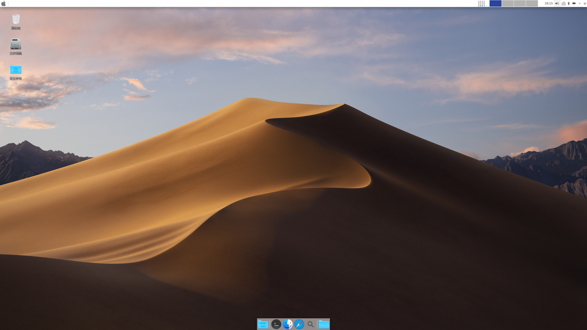

无桌面加强版Web管理界面


无桌面加强版Web管理界面


无桌面加强版Web管理界面


无桌面加强版Web管理界面


CecOS CaaS 容器云


CecOS CaaS 容器云 集群管理


MacOS_Mojave主题桌面截图 多媒体支持

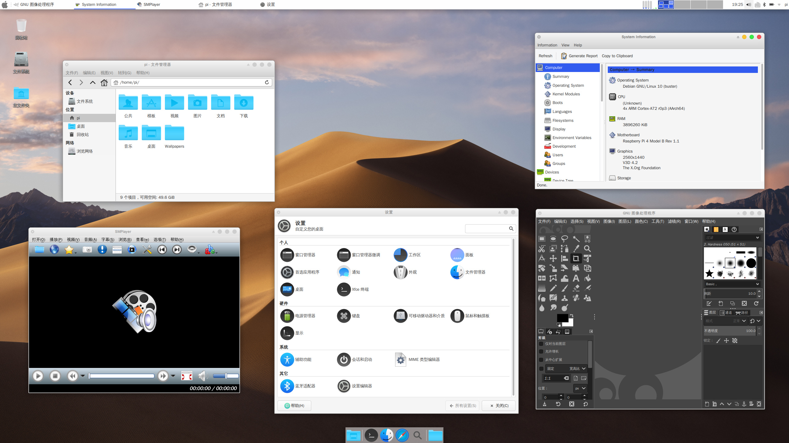

深度(Deepin)桌面截图

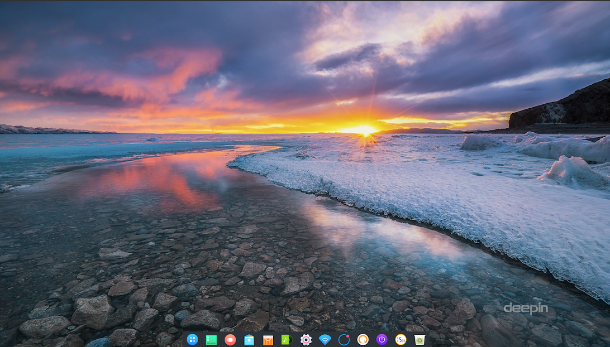

深度(Deepin)桌面截图


深度(Deepin)桌面截图

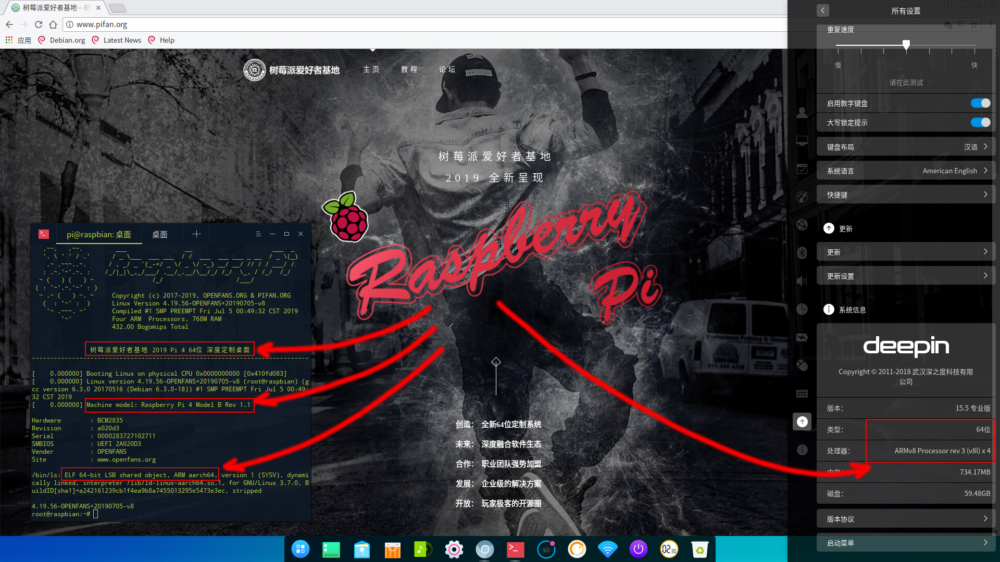

MacOS_Mojave主题桌面截图 虚拟机图形化管理器

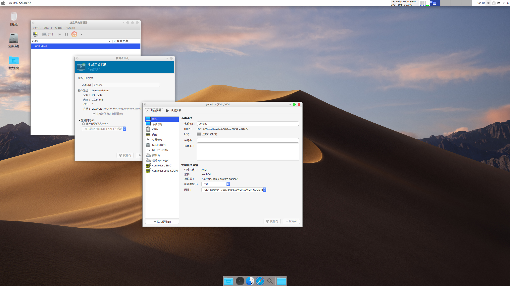

----

MacOS_Mojave主题桌面截图 运行 Android App: 刀塔

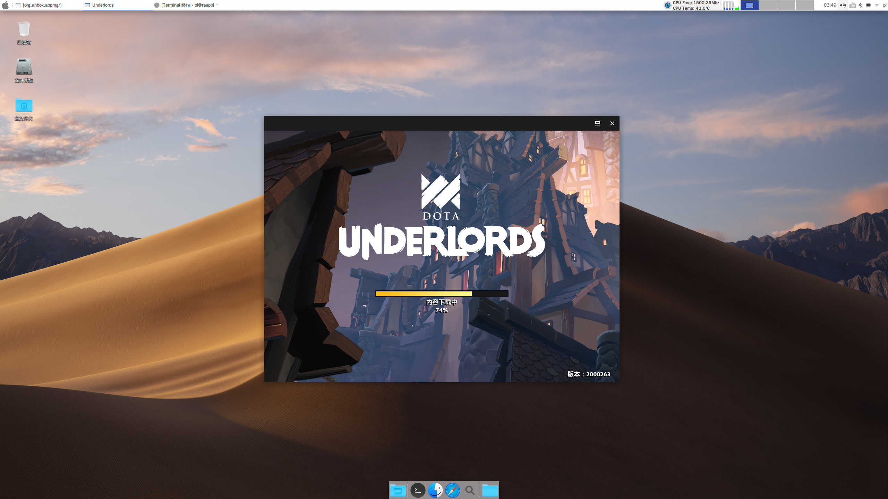

MacOS_Mojave主题桌面截图 运行 Android App: WPS和刀塔

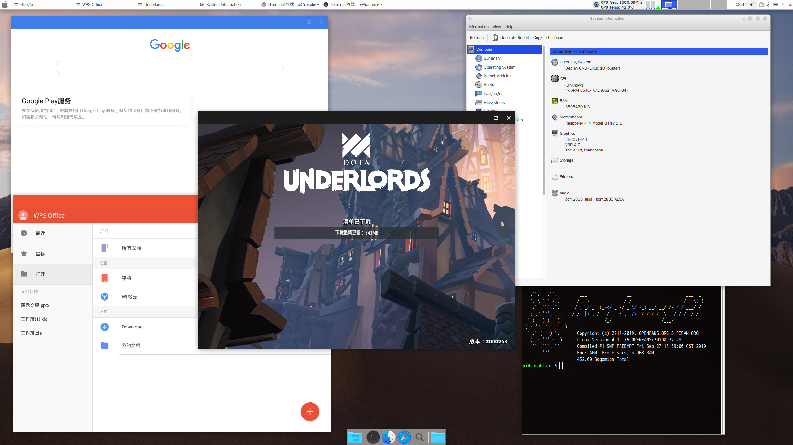

MacOS_Mojave主题桌面截图 运行 *WPS* 桌面版

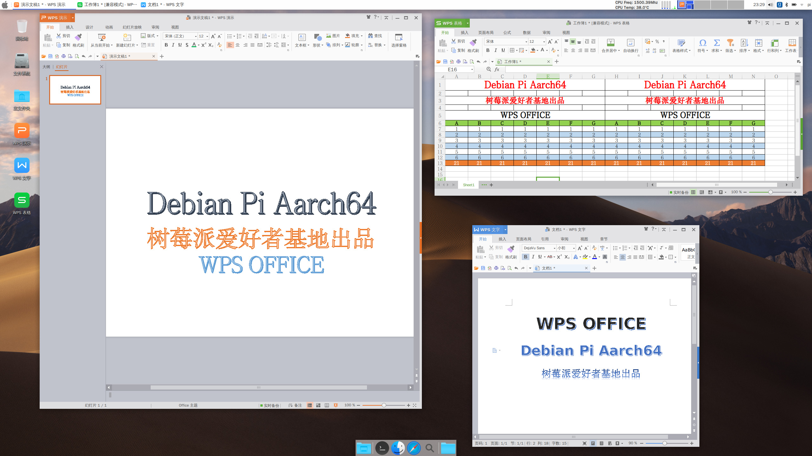

----

**MacOS_Mojave主题桌面截图：在Qemu中运行Windows Arm桌面版**

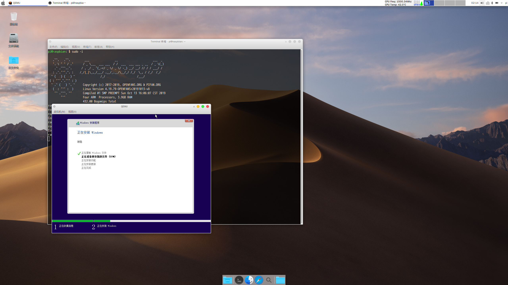

*在Qemu中安装 Windows Arm版本*

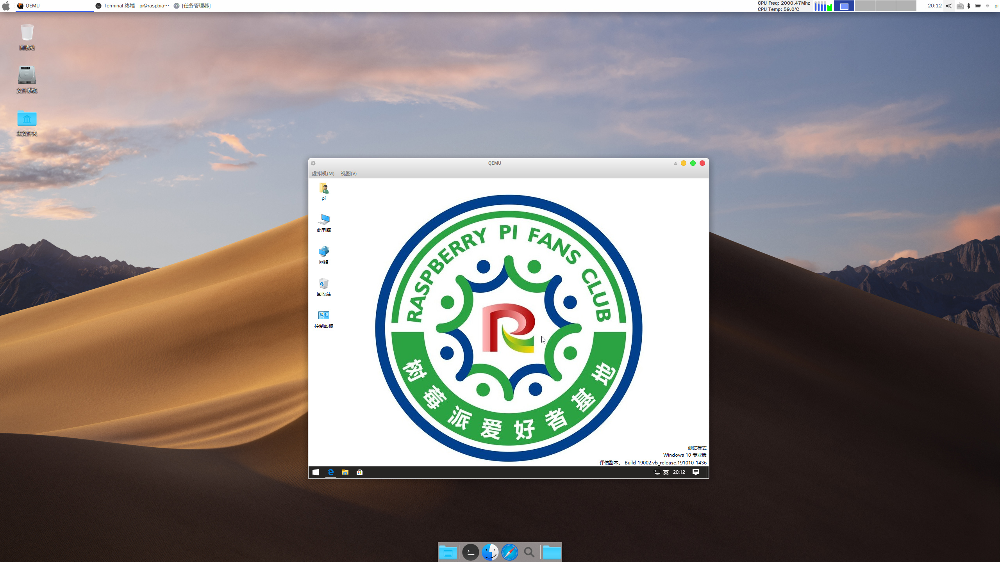

*Windows Arm版 基地桌面*


*Windows Arm版 系统信息*

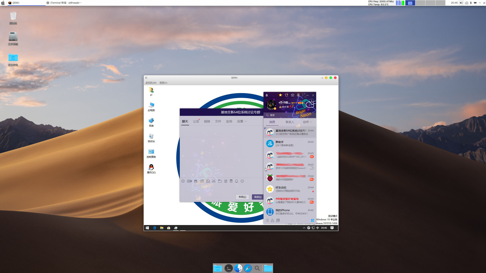

*Windows Arm版 运行X86桌面版QQ*

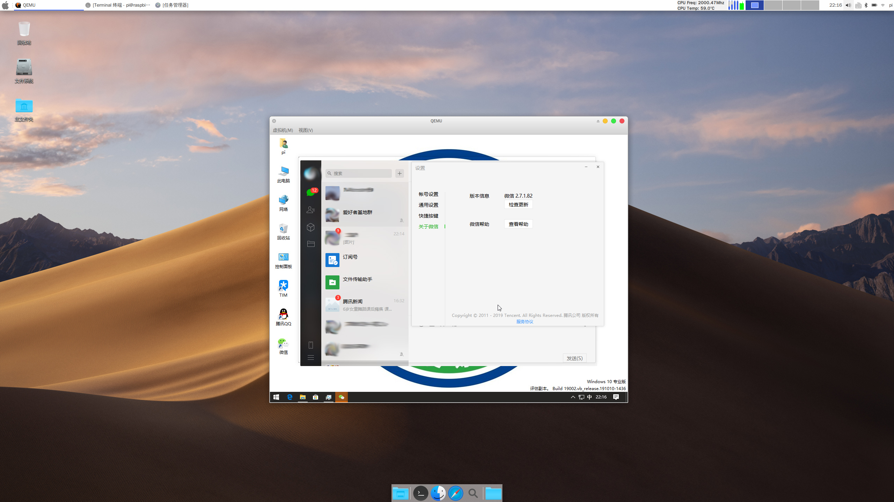

*Windows Arm版 运行X86桌面版微信*

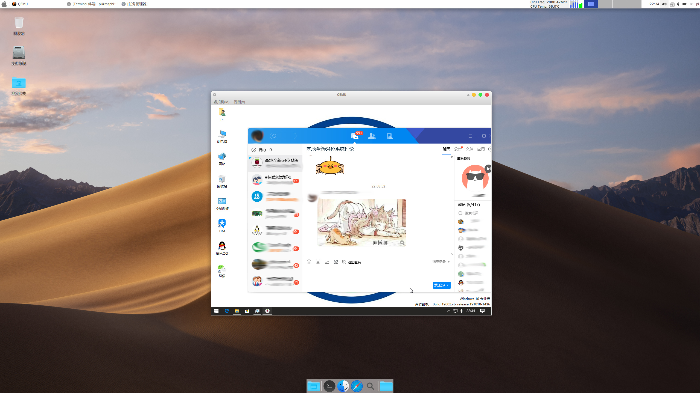

*Windows Arm版 运行X86桌面版TIM*

----

## 1.系统介绍

别问为什么树莓派要用64位系统，64位和32位有什么差别 ？

因为树莓派CPU支持64位，但是官方没有，其他的请自行补脑...

本文所发布的所有版本是已在企业生产环境下使用并验证的正式版本，系统经过严格测试，完全兼容树莓派 3B/3B+/3A+/4B，原生的有线、无线网卡、蓝牙、3D加速均可正常使用，所有系统软件包数量几乎可以媲美X86的版本，系统基于原生 Debian 64位 从头构建（非任何移植版和官改版本），保证原滋原味。

由于和原生树莓派没有关系，所以没有树莓派的相关专有命令（如 raspi-config ，rpi-update 等 ），请自行修改配置文件（ /boot/config.txt ）

为什么选择Debian?

因为树莓派天生和Debian的系统兼容性最好（这离不开Raspbian的功劳，因为Raspbian也是基于Debian构建的，所以树莓派在Debian系下的测试是最完善最充分的，再加上本身Debian系统的强大和稳定，大名鼎鼎的Ubuntu就是基于Debian系最出名和成功的一个发行版）。

本次系统完全不同于之前我们所发布的所有系统(同样也包括之前的64位的Debian )，此次我们全部从头全新构建。在我们的实验室新构建了全新的自动编译和打包、测试系统，同样我们也对系统重新定义了打包流程和调整了所有的相关配置，对内核进行了大量的修改、调整优化和BUG修复，加入了很多新的功能和特性，特别是加入了KVM虚拟化的支持以及重点加强了对Docker的各项特性支持和优化。

**除外，在这次2.0正式版的发布中，我们重新定义和优化了我们自己的专门针对树莓派的交叉编译链工具和编译器，并使用自定义的编译工具重新构建了基础内核以及相关系统模块，大幅度的优化和提高了编译器的编译速度及效率（关于编译链工具及编译器，大家可以参考华为的方舟编译器，有异曲同工之处，我们的编译器主要针对C、C++、G++、ASM、NM、ld、CMAKE、Glib库等底层编译工具进行了优化：专门针对树莓派的ARM aarch64 A53及A72 的 ARM-v8a进行了定制的针对性优化，包括编译硬件架构的指令集等）。**

2019年6月20日，树莓派基金会发布了全新的第四代树莓派单板机4B，我们在第一时间托人从树莓派官方英国剑桥全球专卖店拿到了4代4G的单板机。

- **2019年7月6日，历时半个月的努力，OPENFANS和树莓派爱好者基地联合发布了新的Debian-Pi-Aarch64 2.0系统。**

- **这是全球发行的第一个同时支持树莓派全系64位硬件的64位系统!!!（包括：2Bv1.2，3B，3B+，3A+，4B）**

新的2.0正式版开启了全系的3D加速支持（通过FKMS实现），正式引入**OPENFANS的容器云管理平台** (CecOS CaaS，基于开源的Portainer构建)，较1.0系统将更为完善和强大！

秉承我们OPENFANS和树莓派爱好者基地联合发布的Debian-Pi-Aarch64系统一直以来的优良传统！

系统全面兼容树莓派全线64位CPU的单板机：3B、3B+、3A+、4B，并仍然继承1.0稳定版的全部特性。

----

### 1-1.系统环境（版本介绍）

● **基础系统（无桌面基础版）**

```
标准基础系统镜像，没有X-WINDOWS桌面环境。
**镜像名称：OPENFANS-Debian-Buster-Aarch64-XXXXXX.img
```

● **基础系统Plus++（无桌面加强版）**

```
在标准基础系统之上，加入了可视化的WebUI管理界面支持。
**镜像名称：OPENFANS-Debian-Buster-Aarch64-XXXXXX-plus++.img
```

● **MacOS_Mojave主题定制桌面（全功能版）**

```
在标准基础系统之上基于XFCE深度定制的树莓派爱好者基地的独家系统镜像，具备所有系统的全部功能！！
**镜像名称： OPENFANS-Debian-Buster-Desktop-Aarch64-XXXXXX.img
```

● **深度(Deepin)桌面**

```
基于我们自己的基础系统镜像，移植了完整的深度Deepin 15.5专业版桌面，
这是目前第一个基于完整的Debian Aarch64架构而构建的适配于树莓派3B/3B+/3A/4B的64位深度ARM64镜像。
**镜像名称：OPENFANS-Deepin-Professional-Desktop-Aarch64-XXXXXX.img
```

● **固件升级包**

```
一般命名规则方式为(以 "upkg" 开头)：
upkg-xxxx(年)-xx(月)-xx(日)-vxxxx-x.x-zip/zip.xz
```

----

### 1-2.系统环境（系统相关）

2.0正式版使用**ext4**文件系统，默认使用清华源，基于 **Debian Buster 10 Arm64** 构建。

**2.0正式版暂时不支持从其他任何版本升级而来，需要全新安装。**

### 1-3.各版本功能比较

|项目|无桌面基础版|无桌面增强版|桌面全功能版|深度桌面|
|---|---|---|---|---|
|KVM硬件虚拟化支持|★|★|★|★|
|虚拟机图形化控制端|X|X|★|X|
|Docker容器支持|☆|★|☆|☆|
|CecOS CaaS容器云支持|☆|★|☆|X|
|WebGUI管理平台|X|★|★|X|
|Web SSH 客户端支持|★|★|★|★|
|标准虚拟机套件|★|★|★|X|
|宝塔虚拟机套件|★|★|★|X|

----

**(1)说明：**

**★ ：** 表示支持，并以默认启用，可直接使用。

**☆ ：** 表示支持，但默认未启用该服务，需要用户手动启动。（关于如果启用相关服务，在本文档中有说明。）

**X ：** 表示不支持。

**(2)服务开关：**

Docker容器

```
手动开启：systemctl start docker.service
手动停止：systemctl stop docker.service
启用开机启动：systemctl enable docker.service
禁用开机启动：systemctl disable docker.service
```

CecOS CaaS容器云（服务端口：8443）

```
手动开启：systemctl start cecos-caas.service
手动停止：systemctl stop cecos-caas.service
启用开机启动：systemctl enable cecos-caas.service
禁用开机启动：systemctl disable cecos-caas.service
```

WebGUI管理平台（服务端口：9090）

```
手动开启：systemctl start cockpit.socket
手动停止：systemctl stop cockpit.socket
启用开机启动：systemctl enable cockpit.socket
禁用开机启动：systemctl disable cockpit.socket
```

Web SSH客户端（服务端口：4200）

```
手动开启：systemctl start shellinabox.service
手动停止：systemctl stop shellinabox.service
启用开机启动：systemctl enable shellinabox.service
禁用开机启动：systemctl disable shellinabox.service
```

----

### 1-4.部分系统性能测试结果

#### 1.0版本与同类64位对比测试

一个不完全的测试结果，只是理论数据，仅供参考：

使用 Ext4 标准文件系统和 树莓派3B+ 的 UnixBench 测试结果（和同类Debian Aarch64系统相比）：

* **单线程：**


* **多线程：**


* **整体评分：**


综合整体性能全面超越对比测试系统的2~3倍以上，部分指标甚至达到了10倍以上，1000%的提升。

- 1.0版本与树莓派官方32位系统测试

近来，树莓派官方做了不少优化工作，现在的系统对比以前的32位系统有了较大的提升，但是由于32位原生的架构限制，与64位系统性能差距仍然较大。

**附：** 树莓派爱好者基地**Debian Pi Aarch64 64位 1.0版本**系统与树莓派官方**Raspbian 32位**性能对比测试

*Sysbench 0.4.12 Result：*

| **测试项目** | **ARM32/EXT4** | **ARM64/F2FS** | 测试单位：**时间** / 越**小**越好 |
| --- | --- | --- | --- |
| **系统信息** | 2018-11-13-Raspbian | 树莓派爱好者基地64位U8版 | 提升倍数 |
| **CPU单线程** | 119.2072 | 9.8725 | 12.07 |
| **四线程** | 299.5217 | 24.6616 | 12.15 |
| **八线程** | 299.5824 | 24.6789 | 12.14 |
| **内存随机** | 1.2625 | 0.8751 | 1.44 |
| **内存连续** | 1.5803 | 1.1583 | 1.36 |
| **文件连续读写** | 6.1621 | 2.2928 | 2.69 |
| **文件随机读写** | 484.812 | 6.3527 | **76.32** |
| **互斥锁性能** | 0.0117 | 0.0081 | 1.44 |

最大性能差距倍数： **76.32**

平均性能差距倍数： **14.95**

- 1.0版本测试对比统计图


#### 最新2.0测试版与树莓派官方32位系统测试

测试硬件：树莓派4B

*Sysbench 0.4.12 Result：*

| **测试项目** | **ARM32/EXT4** | **ARM64/EXT4** | 测试单位：**时间**/越**小**越好 |
| --- | --- | --- | --- |
| **系统** | 2019-06-20 raspbian-buster | 2019-07-06 树莓派爱好者基地64位 2.0 Beta版 | 提升倍数 |
| **单线程** | 92.7292 | 6.7406 | 13.757 |
| **四线程** | 231.6591 | 16.8172 | 13.775 |
| **八线程** | 231.5002 | 16.8282 | 13.757 |
| **内存随机** | 2.4225 | 0.6086 | 3.980 |
| **内存连续** | 2.5631 | 0.9267 | 2.766 |
| **文件连续读写** | 6.3636 | 1.8859 | 3.374 |
| **文件随机读写** | 627.719 | 10.6036 | 59.199 |
| **互斥锁性能(4096)** | 0.0206 | 0.0081 | 2.543 |

最大性能差距倍数： *59.199*

平均性能差距倍数： *14.144*

- 2.0版本测试对比统计图 *(统计单位：时间，越小越好)*


----

## 2.主要特性说明

### 2-1.Web可视化管理


全平台Web可视化管理操作（仅桌面版和无桌面增强版提供支持）

全新64位2.0系统上提供了Web管理和操作的支持，至此，全系统平台均实现了可视化的操作管理，不管是标准的桌面图形，还是无桌面的系统(增强版)，Debian Pi Aarch64 正式全面开启可视化时代。

Web管理支持：

```
1.  新增全功能版的支持
2.  全面开启Web管理时代，省去终端工具的麻烦，Anytime,Anywhere, 直接使用浏览器管理
3.  默认开启容器服务，开箱即用 (2.0正式版请通过 CecOS CaaS 容器云 管理和使用容器)
4.  集成WEB界面的全方位监控
5.  支持WEB界面查看系统状况、硬件信息、情况等信息
6.  支持WEB界面设置主机名
7.  支持WEB界面设置主机域
8.  支持WEB界面设置主机时间、NTP服务器，更新方式
9.  支持WEB界面关机、重启
10. 支持WEB界面系统日志管理
11. 支持WEB界面系统存储及相关外设管理，在线分区、挂载设备等功能
12. 支持WEB界面网络管理
13. 支持WEB界面系统账户管理
14. 支持WEB界面系统服务管理
15. 支持WEB界面系统更新管理
16. WEB界面集成Shell终端，可以在网页上直接进行终端相关操作
17. 支持跨节点和统一管理：一个界面管理多台设备，大幅度提升管理和工作效率
18. WEB管理通信使用SSL证书加密，保证会话数据的安全性
```


**WEB SSH** 客户端支持，使用独立的 webshell(ShellinaBox)套件，提供独立的 **web ssh** 登录支持。

### 2-2.QEMU-KVM 虚拟化支持

这是原生Aarch64架构的QEMU虚拟机，支持KVM硬件加速。

我们重新编译了KVM的二进制软件包，解决了在KVM硬件加速环境下 qemu-system-aarch64 的诸多BUG：

开启KVM硬件加速后系统默认版本虚拟机无法运行，无法安装系统，等等...

我们在编译内核时加入了对KVM虚拟机的支持，直接支持全虚拟化的方式运行，添加了支持原生的KVM虚拟硬件内核模块的支持，相关的主要内核模块如下：

```
1.  virtio //标准虚拟磁盘
2.  virtio-scsi //虚拟scsi磁盘
3.  virtio-blk //磁盘直通
4.  virtio-blk-scsi //scsi模式磁盘直通
5.  virtio-net //虚拟网卡
6.  virtio-balloon //内存气泡
7.  virtio-hw-random //虚拟随机数硬件
8.  virtio-console //虚拟终端
9.  virtio-input //虚拟输入设备
10. virtio-crypto-device //虚拟加密设备
12. virtio-drm-gpu //虚拟显卡
13. virtio-9p //目录共享
14. vfio //设备直通
15. vhost //主机数据交互
16. vhost-net  //主机网络数据交互
...
```

**什么是KSM ？**

KSM的原理，是多个进程中，Linux将内核相似的内存页合并成一个内存页。

这个特性，被KVM用来减少多个相似的虚拟机的内存占用，提高内存的使用效率由于内存是共享的，所以多个虚拟机使用的内存减少了，这个特性，对于虚拟机使用相同镜像和操作系统时，效果更加明显

为了更好的优化虚拟机的内存使用效率，我们所有系统的内核默认都支持KSM。

目前2.0系统正式版已全部默认开启虚拟化支持，图形桌面提供可视化的“Virt-Manager”虚拟机管理程序。

### 2-3.Docker 容器支持

大名鼎鼎的Docker这里就不做过多介绍了，本次我们重新编译内核，加入了对Dcoker全特性的各项支持，这可能是目前在 **树莓派Aarch64位系统架构** 下对Docker特性支持最完善的版本 ，其他的绝大多数版本都还是32位系统配上32位docker，原生的64位系统内核缺少了很多对Docker特性的内核支持。

就连大名鼎鼎的32位树莓派Docker系统 **hypriot** 最新版也不能完整支持 **Dcoker Swarm** 。

由于 **Hypriot** 不支持 **bridge vlan/vxlan netfiler** , 你将得到以下错误信息:

```
reexec to set bridge default vlan fialed exit status 1
```

这将导致不能完全正常使用Dcoker Swarm集群，网络缺少相关特性支持，会存在一些功能缺失的问题。

你可以通过 **systemctl status containerd** 和 **systemctl status docker** 以及查看日志的方式在原生的64位ARM系统上发现不少错误和警告信息，拒不完全统计，原生的系统内核至少包括以下特性的缺失：

```
 1. cgroup memory limit
 2. cgroup swap limit
 3. cgroup rt period
 4. cgroup rt runtime
 5. cgroup pid support
 6. cgroup memory sysfs
 7. cgroup rdma
 8. cgroup perf
 9. cgroup bridge vlan/vxlan
10. cgroup netfiler
11. cgroup net prio
12. cgroup cfs bandwidth limit
13. bridge vlan ilter
14. ipvs
15. ipvs ipv6
16. memory sysfs
17. kernel KSM
...
```

**Docker Compose**

Docker官方没有提供基于arm的docker-compose可运行二进制程序，因此我们重新编译并提供了可运行的aarch64位二进制程序，现在默认已加入到系统镜像中，你可以直接使用。

### 2-4.AUFS文件系统支持

**什么是AUFS文件系统 ？**

AUFS的全称是 advanced multi-layered unification filesystem ，主要功能是把多个文件夹的内容合并到一起，提供一个统一的视图，主要用于各个Linux发行版的livecd中，以及docker里面用来组织镜像。

AUFS曾是Docker默认的首选存储驱动，它非常的稳定、有很多真实场景的部署、很强的社区支持，它有以下几个主要优点：

```
1.极短的容器启动时间
2.有效的存储利用率
3.有效的内存利用率
```

但由于它没有包含在Linux内核主线中，所有很多Linux发行版并不支持AUFS。

最新的Docker默认使用的是更快最新的OverlayFS文件系统 ，本系统保持此官方设置的默认值。

**我们是否需要使用AUFS ？**

由于Docker的镜像文件使用的文件系统是分成多层存储的，OverlayFS只支持2层，使用同样的镜像层时会复制多个副本，而且占用更多的空间和I/O，而对于AUFS则不一样，它同样提供使用多层存储的功能并共享数据，Docker使用AUFS的 CoW（Copy-on-Write）写时复制技术来实现镜像共享和最小化磁盘空间的使用。

对于树莓派这样存储空间较小的设备而言，使用AUFS文件系统能更好的利用我们有限的存储空间资源并降低I/O消耗。

为了用户能够根据自己的情况自由的选择和使用OverlayFS还是AUFS，我们在内核中默认加入了对AUFS模块的支持。

由于AUFS并不在原生的Linux内核支持中，所以我们通过AUFS的PATH，为主线4.19的内核加入了AUFS的内核模块代码并重新编译，现在系统启动会自动加载AUFS模块，无需人工干预，即可直接使用。

### 2-5.TCP加速

内核默认已开启 TCP BBR 拥塞控制算法。

**什么是 TCP BBR ？**

我们还是简答来说 TCP BBR 解决了什么问题吧:

```
1. 在有一定丢包率的网络链路上充分利用带宽，非常适合高延迟、高带宽的网络链路
2. 降低网络链路上的 buffer 占用率，从而降低延迟，非常适合慢速接入网络的用户
```

简单来说使用 TCP BBR 拥塞控制算法能够在一定程度上提升TCP传输速度和效率，优化网络传输。

**如何关闭**:

编辑 “/mnt/etc/sysctl.conf” 文件，执行命令 "sysctl -p" 查看结果，看不到以下注释掉的内容，代表关闭成功。

注释掉以下2行内容： (前面加上#即可)

```
net.core.default_qdisc=fq
net.ipv4.tcp_congestion_control=bbr
```

### 2-6.内存及交换优化（算法级）

- **支持：Swap交换分区**

本次新版系统默认增加了对Swap交换缓存的支持，以缓解系统内存不足所造成的死机问题，大大提升了可执行大容量内存需求应用程序的支持和效率，用户无需手动创建系统Swap，我们的系统在安装完成后将自动完成并初始化Swap，Swap文件或分区的位置可以通过查看系统挂载配置文件 /etc/fstab 来调整。

- **支持：zSWAP虚拟内存压缩**

本次新版系统内核默认已加入了 **zSWAP** 虚拟内存压缩功能，可为将要交换的页面提供压缩回写缓存，默认占用物理内存上限为系统总内存的 **25%** 。

**zSWAP的好处**：

当内存页将要交换出去时，zSWAP不将其移动到交换设备，而是对其执行压缩，然后存储到系统RAM内动态分配的内存池中，回写到实际交换设备的动作则会延迟，甚至能完全避免，从而显著减少Linux系统用于交换的I/O。对于树莓派这样依托于TF卡的设备，本来I/O就不是很高，减少用于交换的I/O的操作就意味着提高系统性能，把I/O用在系统应用程序等更需要的其他调度上去。

在使用Swap文件/分区的场景下，由于减少了对Swap文件/分区的I/O操作，可以提升TF的使用寿命。

zSWAP并不虚拟一个块设备，而是hook到普通的Swap代码里，在实际发生写入到磁盘/从磁盘读取的操作前，先利用自己管理的内存进行数据的换出/换入，内存不够用以后再使用传统的Swap文件/分区。所以zSWAP适用于本身已经有交换分区的系统，以及树莓派这样本身内存不大的硬件设备。

**为什么不使用zRAM？**

zSWAP同时使用内存和交换分区，并根据实际情况自动调整所占内存的大小，所缓存的数据在系统内存不够用时会自动存入到Swap文件/分区中，大大提高了系统swap交换的效率，更充分的利用了内存空间资源又避免了系统出现内存不够的情况，而zRam完全使用内存来进行操作和存储数据，完全占用内存，一般用在大内存的场景，这对于内存很小的树莓派来说就不合适了。

**zSWAP在本系统中使用的内存分配器和数据压缩算法** ：

```
内存分配器zpool框架： smalloc、zbud、z3fold
```

现实表明，zsmalloc虽然压缩率高，但是算法复杂，还需要额外的线程负责内存整理，耗费更多的cpu时间。

而zbud实现简单，以内存page为单位的存储又不会产生内存碎片，但是压缩率低，最高只有2倍，不满足小内存系统的实际需求。

因此，索尼开发了z3fold内存分配器，和zbud的实现完全一致，只是每个page可以存储3个compressed page，最高压缩率有 3 倍，逼近zsmalloc的4倍，该技术在xperia xzp的中使用，使4GB的手机获得超过4GB内存的体验。

我们在系统中选用了z3fold算法，在系统 /boot/cmdline.txt 中可以看到配置：

```
zswap.enabled=1 zswap.zpool=z3fold zswap.compressor=lz4 zswap.max_pool_percent=25
```

**压缩算法**

Linux有很多压缩算法：lz,lzo,xz,gzip,lzma...

我们这里采用了拥有极高压缩速度和较高压缩率的lz4 ，lz4相对于其他压缩算法而言，压缩率不是最高的，但速度确是最快的，在已采用 z3fold 算法的情况下，结合树莓派本身的性能特点和实际的测试，在拥有不错的压缩率的情况下，速度对于树莓派来说才是最重要的（考虑到本身CPU性能开销和内存大小的情况）。

### 2-7.MacOS_Mojave主题桌面


默认桌面主题使用仿 **MacOS Mojave** 主题的桌面。

### 2-8.CecOS_CaaS容器云


我们在2.0正式版的系统中移除了原WebUI管理界面的容器管理支持，而是用了OPENFANS基于开源项目"Portainer"并专门针对国人进行了再次深度定制的二次开发、提供的 **CecOS CaaS 容器云** ，这是 **完整的容器云平台** 的支持，完整具备了管理整个 **Docker Swarm** 集群环境的所有功能！

包括但不限于对 **容器节点、集群、存储、网络、镜像仓库、模板、堆栈、任务计划、用户组、权限控制** ... 等太多太多的功能支持！！

### 2-9.其他特性

- 支持3D加速，默认所有桌面环境已开启

- 新版2.0特性太多，这里就不再一一例举说明，以上只列举主要特性，其他特性请老铁们自行发掘 :)

----

## 3.使用说明

### 3-1.系统初始化说明

系统开机将自动扩展根分区，然后会自动进行相关配置，待完成后方可正常使用，此过程中系统将 **自动重启3次** 。

### 3-2.账户及密码

系统默认账户：**pi** ，默认密码：**raspberry**

默认账户pi账户支持ssh登录，root账户密码请登陆后使用命令 **“sudo passwd root”** 执行设置，

或使用命令 **“sudo -i”** 来切换到root用户。

### 3-3.Web登录接口说明

```
1.Web可视化管理界面
登录地址 https://你树莓派的IP地址:9090
说明：请使用系统默认账户pi登录

2.WEB SSH 客户端 入口界面
登录地址 https://你树莓派的IP地址:4200
说明：使用具有控制台登录权限的帐户登录，例如：pi

3.CecOS CaaS 容器云管理平台 登录界面
登录地址 https://你树莓派的IP地址:8443
说明：默认管理账户 admin , 默认密码：password 。请登录后立即修改默认密码！！

```

### 3-4.预配置项

系统提供网络和自动开机任务的预配置，相关配置文件的路径和对应关系如下：

| 预配置项 | 预配置文件路径 | 对应链接到的系统文件路径 |
| --- | --- | --- |
| 无线网络 | /boot/wpa_supplicant.conf | /etc/wpa_supplicant/wpa_supplicant.conf |
| 有线网络 | /boot/interfaces | /etc/network/interfaces |
| DHCP客户端 | /boot/dhclient.conf | /etc/dhcp/dhclient.conf |
| 自定义启动脚本 | /boot/rc-local | /etc/rc.local |

### 3-5.无线配置说明

桌面化环境可以登录到桌面环境后通过图形化界面设置，这里提供配置文件的修改方式。

如果桌面化环境想使用修改配置文件的方式连接无线网络，请查看[此处](./README_zh.md#3-161%E5%9B%BE%E5%BD%A2%E5%8C%96%E6%A1%8C%E9%9D%A2%E7%8E%AF%E5%A2%83%E4%BD%BF%E7%94%A8%E9%85%8D%E7%BD%AE%E6%96%87%E4%BB%B6%E8%BF%9E%E6%8E%A5%E6%97%A0%E7%BA%BF%E7%BD%91%E7%BB%9C)说明。

修改 **/boot/wpa_supplicant.conf** 文件

```
## To use this file, you should run command "systemctl disable network-manager" and reboot system. 
## (Do not uncomment this line and above!) ##
## 除第一行外，第一行可以删除，去掉以下每行只有单个“#”的注释符号，两个“#”注释符号的行位说明内容，请不要修改
## 中文内容是注释，删除或不要取消前面的“#”符号

## country是设置无线的国家地区，CN是中国
#country=CN
#ctrl_interface=DIR=/var/run/wpa_supplicant GROUP=netdev
#update_config=1

## 下面的 "WIFI 1" 、"WIFI 2" 代表多个无线网络的设置
## 除非你要设置多个无线网络，否则只需要设置 "WIFI 1" 这部分的设置即可
## WIFI 1 (Do not uncomment this line!)

## 除了取消需要生效的内容注释以外，以下仅需要修改 "ssid" 和 "psk" 后面引号内的内容即可
## ssid是你的无线Wifi名称，psk是你无线Wifi的密码
#network={
#    ssid="your-wifi1-ssid"
#    psk="wifi1-password"
#    priority=1
#    id_str="wifi-1"
#}


## WIFI 2 (Do not uncomment this line!)

#network={
#    ssid="your-wifi2-ssid"
#    psk="wifi2-password"
#    priority=2
#    id_str="wifi-2"
#}
```

**无线地区码设置：**

编辑 **/etc/default/crda** 文件，编辑 **REGDOMAIN=** 后面的内容，默认已设置为 **“CN”中国** ，一般情况下无需设置。

**附无线常用地区码：**

```
AU 澳大利亚
CA 加拿大
CN 中国
GB 英国
HK 香港
JP 日本
KR 韩国
DE 德国
US 美国
TW 台湾
```

### 3-6.有线网络配置

修改 **/boot/interfaces** 文件

```
# interfaces(5) file used by ifup(8) and ifdown(8)
# Include files from /etc/network/interfaces.d:
source-directory /etc/network/interfaces.d
## Used dhcp ip address set eth0 inet to dhcp,
## or used static ip address set eth0 to static
## and change other ip settings.
## If you wanna let settings to take effect,
## uncomment symbol in front.

#auto eth0
#allow-hotplug eth0

#iface eth0 inet dhcp
#iface eth0 inet static
#address 172.16.192.168
#netmask 255.255.255.0
#gateway 172.16.192.1
#dns-nameservers 8.8.8.8
```
### 3-7.开机自定义启动脚本

系统支持自定义任务自启动脚本，可以在系统启动前预先配置。

编辑脚本文件 **"/boot/rc-local"** ，在 **“exit 0”** 前加入自定义的脚本内容。

### 3-8.深度桌面禁止自动升级的说明

**在版本v2019-11-10之后(也包括版本2019-11-10在内)，深度系统已经支持升级。**

由于 Deepin系统和上游仓库存在一定的兼容性问题(deepin本身的问题)，除非你清楚自己需要做什么，否则强烈建议不要使用以下的任何一条命令或者其他任何会使得系统进行升级的操作！！！所有的Deepin版本系统都需要注意，包括1.0和2.0的所有Deepin版本!

```
apt upgrade
apt-get upgrade
apt dist-upgrade
apt-get dist-upgrade
```

**PS：**

*部分的软件安装由于deepin本身兼容性的问题，可能存在BUG造成系统无法启动或其他任何未知问题，由于软件太多我们无法一一测试，欢迎大家反馈，建议通过源码安装。*

*深度软件商店的软件是由深度提供的，非我们提供，目前深度软件商店暂时没有提供对arm64的软件支持，如有任何需求，请到深度官方论坛寻求帮助。*

*这里我们强烈建议使用我们提供的定制的 MacOS_Mojave主题桌面版本。*

### 3-9.中文环境下TTY显示中文字体(非远程方式)

注意：远程登录的方式无视这个问题，不会存在乱码的问题，仅在通过本地显示器或串口连接使用本地终端时由于Linux内核本地的标准TTY不支持显示中文字体，会显示乱码时才需要执行相关操作。

我们需要安装fbterm扩展支持，在连网环境下执行如下操作：

```
## 安装fbterm
sudo apt update; sudo apt install fbterm -y
## 添加登录用户到video组
sudo adduser root video ; sudo adduser pi video 
sudo adduser 你自己创建的其他用户名(若果有) video
## 然后每次需要显示时执行以下命令即可（第一次需要等待一些时间）：
fbterm
```

### 3-10.macOS Mojave主题桌面支持Web界面VNC远程桌面访问

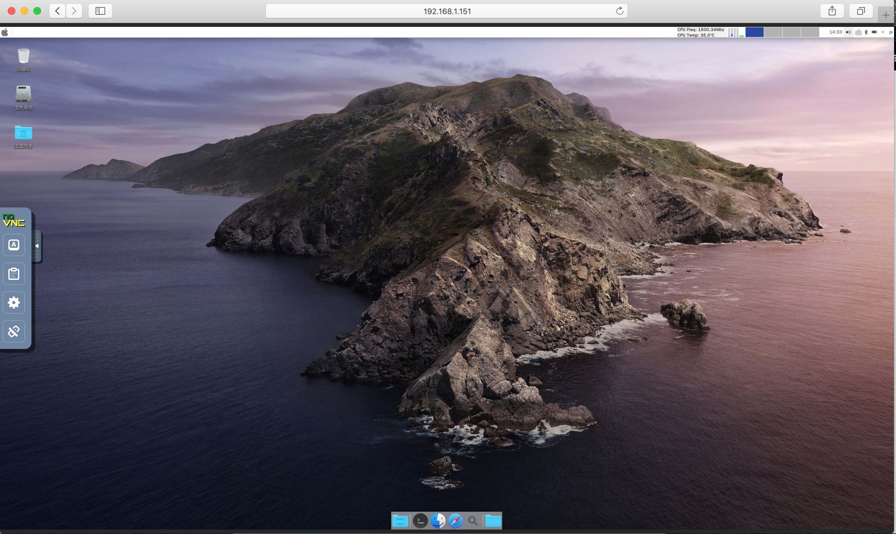

macOS Mojave主题桌面环境(全功能版) 在 *2019-11-17*(包括) 之后的版本默认情况下已支持Web界面的VNC远程桌面访问。

```
默认的VNC访问密码为: raspberry
默认的WEB VNC访问地址为: http://你树莓派的IP地址:5901
默认的客户端访问地址为: 你树莓派的IP地址:5900
```

您不能使用Web VNC界面和客户端在同一时间连接到同一个vnc服务器。

如果要使用客户端连接vnc服务器，建议您使用RealVNC客户端，您可以单击 [此处](https://www.realvnc.com/en/connect/download/viewer/) 下载RealVNC客户端。

#### Web VNC远程桌面使用说明

访问系统默认的VNC有两种方法：

● 连接了真实的显示器

```
VNC已默认启用，您无需执行任何操作。
```

● 未连接任何显示器

```
默认情况下已启用VNC服务，但如果未连接到任何真实的显示器，则应使用虚拟显示的支持，运行命令：
"virtual-monitor-enable"
以启用"虚拟显示器模式"，此后系统将自动重启并完成设置。
```

#### 重要

```
如果启用了"虚拟显示器模式"，则不能同时连接到真实的显示器(否则真实显示器将没有显示)，
如果启用了"虚拟显示器模式"，请运行命令："virtual-monitor-disable"
以禁用"虚拟显示器模式"来恢复正常。
```

**注意：系统默认未开启 "虚拟显示器模式"**

#### Commands for default VNC

**virtual-monitor-enable**

```
启用"虚拟显示器模式"，在没有外接真实显示器的时候使用。
此后系统将自动重启并完成设置。
```

**virtual-monitor-disable**

```
启用"虚拟显示器模式"，以连接到真实显示器的时候使用(系统默认模式)。
此后系统将自动重启并完成设置。
```

**enable-vnc**

```
启用VNC服务(系统默认已开启)。
此后系统将自动重启并完成设置。
```

**disable-vnc**

```
禁用VNC服务。
此后系统将自动重启并完成设置。
```

**vnc-passwd**

```
修改默认的VNC访问密码。
```

----

如果需要安装另一个VNC服务器软件包(如RealVNC), 则可以执行以下操作：

(安装前您需要先禁用我们系统默认的VNC服务)

但是我们仍然建议您使用我们系统提供的默认VNC。

#### 安装macOS Mojave主题桌面环境的RealVNC远程桌面

```
vnc_pkg='VNC-Server-6.6.0-Linux-ARM.deb' ; \
sudo \
sed -i '/deb http:\/\/mirrors.tuna.tsinghua.edu.cn\/debian\/ sid main non-free contrib/d' \
/etc/apt/sources.list ; \
sudo apt clean all ; \
sudo echo 'deb http://mirrors.tuna.tsinghua.edu.cn/debian/ sid main non-free contrib' \
>>/etc/apt/sources.list ; \
sudo dpkg --add-architecture armhf ; sudo apt update ; \
cd ~ ; wget https://www.realvnc.com/download/file/vnc.files/$vnc_pkg ; \
sudo apt install ./$vnc_pkg ; \
rm -rf ./$vnc_pkg ; \
sudo dpkg --remove-architecture armhf ; sudo apt update ; \
sudo systemctl enable vncserver-x11-serviced.service ; \
sudo systemctl start vncserver-x11-serviced.service ; \
sudo \
sed -i '/deb http:\/\/mirrors.tuna.tsinghua.edu.cn\/debian\/ sid main non-free contrib/d' \
/etc/apt/sources.list ; \
sudo apt clean all ; sudo apt update
```

**注意：**

```
sudo \
sed -i '/deb http:\/\/mirrors.tuna.tsinghua.edu.cn\/debian\/ sid main non-free contrib/d' \
/etc/apt/sources.list ; \
```

**在上面安装RealVNC过程中的这条命令千万别漏掉!!!**

点击 [此处](https://www.realvnc.com/en/connect/download/viewer/) 前往下载RealVNC的客户端。

安装并运行客户端，直接输入IP地址即可，不需要填写端口，用户名和密码是你系统的登录用户和密码。

**说明:**

*Realvnc的一些高级说明*

#### 将RealVNC安装为系统的守护进程服务模式

启动或停止RealVNC服务:

```
systemctl (start-stop) vncserver-x11-service.service
```

启用或取消RealVNC服务开机自启动:

```
systemctl (enable-disable) vncserver-x11-service.service
```

杀死所有相关的服务进程:

```
killall vncserver-x11-core vncserver-x11 vncagent vncserverui
```

**当你没有外接显示器的时候你需要按以下方法操作**

*RealVNC虚拟显示服务模式*

在此模式下，VNC连接地址为：

```
你树莓派的IP地址:1
```

```
## A模式：

将RealVNC安装为系统的守护进程虚拟显示服务模式
(这个功能需要RealVNC的license授权)

启用或关闭RealVNC虚拟显示服务：

    systemctl (start-stop) vncserver-virtuald.service

启用或取消RealVNC虚拟显示服务开机启动：

    systemctl (enable-disable) vncserver-virtuald.service
```

```
## B模式：

运行RealVNC安装为系统的守护进程虚拟显示服务的另一种模式：
(自定义方法，不需要授权)
(参考自Pi官方论坛 https://www.raspberrypi.org/forums/viewtopic.php?t=249124)

按照以下步骤操作：

1. 安装软件包：

    apt install xserver-xorg-video-dummy -y

2. 执行命令：

    killall vncserver-x11-core vncserver-x11 vncagent vncserverui ;\
    systemctl stop vncserver-x11-serviced.service ;\
    systemctl disable vncserver-x11-serviced.service ;\
    systemctl stop vncserver-virtuald.service ;\
    systemctl disable vncserver-virtuald.service

3. 创建服务脚本文件：

/usr/lib/systemd/system/vncserver-pi.service

---------------------------------------------------
[Unit]
Description=VNC Server in Virtual Mode daemon
After=network.target

[Service]
User=pi
Type=forking
ExecStart=/usr/bin/vncserver :1
ExecStop=/usr/bin/vncserver -kill :1
Restart=on-failure
RestartSec=5
KillMode=process

[Install]
WantedBy=multi-user.target
---------------------------------------------------

4. 为所有系统用户启用Xorg系统服务，执行命令：

    vncinitconfig -enable-system-xorg

    所有的选择都回答："Y"

    如果你想禁用可以执行：

    vncinitconfig -disable-system-xorg

5. 生成 "/etc/X11/vncserver-virtual.conf" 配置文件，执行：

    vncinitconfig -virtual-xorg-conf

6. 将服务设置为开机自启动并启动服务：

    systemctl enable vncserver-pi.service
    systemctl start vncserver-pi.service


已知问题：
该模式下无法重启vncserver-pi.service服务，
你只能通过重启系统来实现。
```

### 3-11.切换声音输出通道

2.0系统默认声音使用 **HDMI** 输出

切换声音输出的命令：

```
amixer cset numid=3 2
这里将输出设置为2，也就是HDMI。
将输出设置为1将切换到模拟信号（也就是耳机接口）。
默认的设置为0，代表自动选择
```

修改完音频设置后，需要重新启动Raspberry Pi，以使更改生效。

**如果仍然无法通过HDMI接收声音:**

在极少数情况下，有必要进行编辑config.txt以强制使用HDMI模式(与不发送声音的DVI模式相对)。

您可以通过编辑 **/boot/config.txt** 文件并设置 **hdmi_drive=2** ，然后重新启动以使更改生效。

### 3-12.32位软件armhf支持

```
dpkg --add-architecture armhf
apt update
## 需要先安装32位的"libc6:armhf"的基础库
apt install libc6:armhf
apt install 其他软件包名:armhf
## 安装32位软件请在包的名称后加入后缀 ":armhf"
```

### 3-13.启用和运行Docker服务

无桌面基础版和桌面全功能版默认没有启用 **Docker服务**，需要手动启动。

```
开机自动启动Docker服务
systemctl enable docker.service

启动Docker服务
systemctl start docker.service

######

停止Docker服务
systemctl stop docker.service

禁止Docker服务开机启动
systemctl disable docker.service

```

### 3-14.启用CecOS-CaaS容器云

无桌面基础版和桌面全功能版默认没有启用 **CecOS CaaS容器云** 服务，需要手动启动。

**注意：要启用CecOS CaaS容器云服务，必须要先启用和启动docker服务！！**

```
开机自动启动 CecOS CaaS容器云 服务
systemctl enable cecos-caas.service

启动 CecOS CaaS容器云 服务
systemctl start cecos-caas.service

######

停止 CecOS CaaS容器云 服务
systemctl stop cecos-caas.service

禁止 CecOS CaaS容器云 服务开机启动
systemctl disable cecos-caas.service
```

### 3-15.启用和退出Docker集群

```
#初始化并加入一个 Docker Swarm集群
docker swarm init

#查看集群节点状态
docker node ls

#退出Docker Swarm集群
docker swarm leave --force
```

### 3-16.FAQ常见问题说明

#### 3-16.1图形化桌面环境使用配置文件连接无线网络

图形化桌面环境使用配置文件连接无线网络，在修改完 **“/boot/wpa_supplicant.conf”** 文件后，为了保证良好的网络兼容性，请执行以下操作：

使用root用户身份执行：

```shell
systemctl disable NetworkManager
```

然后执行：

```shell
sed -i  \
's/sudo systemctl restart NetworkManager/## sudo systemctl restart NetworkManager/g' \
/home/pi/.xsessionrc
```

最后重启即可。

#### 3-16.2使用APT命令安装软件包时版本不匹配

**问题描述：**

*在使用命令apt在线安装deb包时，遇到找不到匹配版本的问题，如：*

```
The following packages have unmet dependencies:
 package-name-1 : Depends: package-name-2 ( >= x.x.x-xxx-2 ) but x.x.x-xxx-1 is to be installed
              Recommends: package-name-3 but it is not going to be installed
E: Unable to correct problems, you have held broken packages.
```

亦或者是：

```
下列软件包有未满足的依赖关系：
 package-name-1 : 依赖: package-name-2 ( >= x.x.x-xxx-2 ) 但是 x.x.x-xxx-1 正要被安装
               依赖: package-name-3 但是它将不会被安装
E: 无法修正错误，因为您要求某些软件包保持现状，就是它们破坏了软件包间的依赖关系。
```

**问题根源：**

由于我们的系统引入了部分较新的上游软件包所致。

**解决办法：**

临时启用上游软件源**sid**仓库即可，在你的**apt**命令前加上`sid-used sudo`命令：

例如：`sid-used sudo` **apt install package-name**

### 3-17.配套应用程序使用说明

#### 3-17.1 WPS Office ARM64位 桌面版安装说明

至下载仓库的**APP**文件夹，对应下载最新的一键安装包，解压后进入安装包目录，在**已经连接公网的环境下**，

使用**root**用户身份执行以下命令即可：

```
sudo ./install.sh
```

**注意：** 仅在 *macOS_Mojave主题定制桌面 (全功能版)* 上通过安装测试 !!!

**仅供测试和学习使用!!!**

#### 3-17.2 腾讯QQ官方Linux桌面版安装说明

确保在连接互联网的情况下以root用户身份运行以下命令：

```
qq_pkg='linuxqq_2.0.0-b1-1024_arm64.deb' ; \
cd ~ ; \
wget https://raw.githubusercontent.com/openfans-community-offical/Debian-Pi-Aarch64/master/add-app/$qq_pkg ; \
apt install ./$qq_pkg -y ; \
rm -rf ./$qq_pkg
```

执行上述操作以后，LinuxQQ桌面版应该安装完毕。

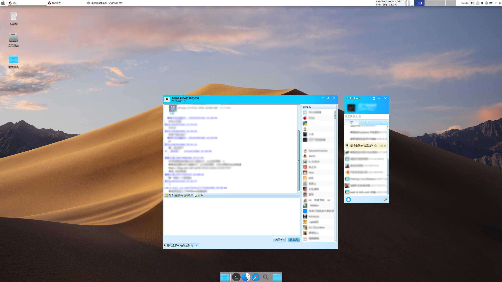

----

## 4.虚拟机使用说明

虚拟机资源包一般以压缩包的形式发布，执行以下命令安装解压压缩包的支持：

```
apt update ; apt install tar gzip zip unzip bzip2 xz-utils -y
```

### 4-1标准虚拟机使用说明

默认用户：root (已开通远程权限) ， 密码：raspberry

解压虚拟机资源包后，进入虚拟机的资源包目录，解压虚拟磁盘镜像：

```
xz -d -k disk.qcow2.xz
```

会得到一个 **disk.qcow2** 的虚拟磁盘镜像，恢复系统的话可以随时执行上面的命令还原初始硬盘。

**运行虚拟机：**

```
sudo ./vm_run

## 以上脚本命令默认将以后台的方式运行虚拟机
```

以前台的方式运行虚拟机：

复制一份 **vm_run** 文件，并将及命名为 **vm_run2** ， 打开 **vm_run2** 文件，删除以下2行的内容：

```
...  ## 省略的内容
nohup  \
...  ## 省略的内容
  & 
...  ## 省略的内容
```

然后，运行 “sudo ./vm_run2” 即可。

**远程登录：**

该虚拟机的22号端口已默认映射到了本机的2222号端口，SSH访问本机的2222号端口即可。

命令示例：

```
ssh -p 2222 root@本机的IP地址
```

----

### 4-2宝塔虚拟机使用介绍

为了照顾小白和响应群众呼声，我们终于“顺便”把宝塔给你们集成进来了，用的是虚拟机的方式，32位超级干净的定制专为宝塔优化的ARMHF虚拟系统，即使是虚拟机，速度也大幅度强过官方的底板系统（谁用谁知道 ：） -- ）。

来张跑分图：


默认安装了所有的软件，5.9.1 相对较稳定的专业“学习版”，你懂得，最好别升级“已学习”的软件的版本，否则被收保护费我可不管。

**为什么集成宝塔？**

```
1.小白使用确实方便；
2.群众呼声太高；
3.顺便...
```

**为什么不在64的系统中直接集成？**

```
1.不是每个人都需要默认集成，太臃肿；
2.环境构建造成更复杂的兼容性问题；
3.宝塔对ARM64兼容性不够友好；
4.宝塔不只是安装那么简单的一件事，里面需要的软件在ARM系统下编译耗时过长；
5.我们使用中的部分版本组合问题；
6.不是说宝塔整体不好，至少在ARM64上的兼容性上对小白是个很大的挑战。
```

**使用方法：**

同标准虚拟机的使用方式一样，解压压缩包，然后进入虚拟机的目录，执行相关操作。

**安装：**

```
sudo ./install
```

**启动宝塔虚拟机：**

```
./bt_run
```

**关闭宝塔虚拟机：**

为了保证虚拟机的数据同步安全，请按照以下步骤操作：

```
请ssh登录到虚拟机再执行命令 " init 0 " 关闭虚拟机

关闭后，需要在宝塔虚拟机目录下执行 " ./bt_prog " 命令，检查虚拟机是否已关闭

如果没有任何输出结果，代表虚拟机已正常关闭

如果无法正常关闭虚拟机，请在宝塔虚拟机目录下执行 " ./bt_prog kill " 命令

同样记得再次执行 " ./bt_prog " 命令，检查虚拟机是否已关闭
```

**自动启动**

```
## 启用开机自动启动
./install int

## 取消开机自动启动
./install uint
```

**默认参数值:**

|项目|内容|
|---|---|
|默认管理端口|28888|
|默认管理地址|http://你树莓派的IP地址:28888/|
|默认Web管理用户及密码|openfans/openfans|
|宝塔虚拟机ssh端口|2222|
|宝塔虚拟机root默认密码|raspberry|

**如何ssh连接到宝塔虚拟机?**

```
本机连接： ssh -p 2222 root@localhost
外部连接： ssh -p 2222 root@你树莓派的IP地址
```

**注意:**

```
除非你懂得修改 install 部署脚本，否则不要修改宝塔面板默认的管理端口。
如果你需要开启自定端口的站点支持，请编辑 ports文件 加入你自定义的端口，但不要修改 ports 文件里其他默认的端口。
```

**为了方便和节约大家时间，默认一次性开启了宝塔的所有功能。**

**为了更好的性能起见，我们强烈建议关闭或删除自己不需要的功能。**

----

### 4-3如何扩展虚拟机的磁盘大小

首先确认你的虚拟机已正常关闭或没有运行。

本文虚拟机磁盘以 **bt.qcow2.disk** 为例。

#### 4-3.1. 磁盘扩容

**查看磁盘大小**

执行命令：

```shell
qemu-img info bt.qcow2.disk
```

得到如下信息:

```shell
image: bt.qcow2.disk
file format: qcow2
virtual size: 10G (10737418240 bytes)    #磁盘总大小
disk size: 6.4 # 已用容量
cluster_size: 65536
Format specific information:
    compat: 1.1
    lazy refcounts: false
    refcount bits: 16
    corrupt: false
```

**磁盘扩容**

本例我们的目标是为虚拟机磁盘增加10G的容量

执行下面的命令：

```shell
qemu-img resize bt.qcow2.disk +10G
```

然后再次查看磁盘大小

执行命令：

```shell
qemu-img info bt.qcow2.disk
```

结果如下：

```shell
image: bt.qcow2.disk
file format: qcow2
virtual size: 20G (21474836480 bytes)    #容量增加成功，总大小为20G
disk size: 6.4G
cluster_size: 65536
Format specific information:
    compat: 1.1
    lazy refcounts: false
    refcount bits: 16
    corrupt: false
```

#### 4-3.2. 扩展分区

**扩展已增加的容量至系统分区**

首先，启动虚拟机，并登陆虚拟机。

```shell
ssh -p 2222 root@localhost
```

**查看磁盘大小**

执行命令：

```shell
fdisk -l /dev/sda
```

结果如下：

```shell
Disk /dev/sda: 20 GiB, 21474836480 bytes, 41943040 sectors    #已增加到20G
Units: sectors of 1 * 512 = 512 bytes
Sector size (logical/physical): 512 bytes / 512 bytes
I/O size (minimum/optimal): 512 bytes / 512 bytes
Disklabel type: dos
Disk identifier: 0xcd0e4df1

Device     Boot Start      End  Sectors Size Id Type
/dev/sda1  *     2048 20969471 20967424  10G 83 Linux    #分区容量还未扩展
```

**查看分区大小**

执行命令：

```shell
df -hT
```

结果如下：

```shell
Filesystem     Type      Size  Used Avail Use% Mounted on
udev           devtmpfs  496M     0  496M   0% /dev
tmpfs          tmpfs     103M  1.5M  101M   2% /run
/dev/sda1      btrfs      10G  4.7G  4.7G  50% /        #分区容量还未扩展
tmpfs          tmpfs     513M  4.0K  513M   1% /dev/shm
tmpfs          tmpfs     5.0M     0  5.0M   0% /run/lock
tmpfs          tmpfs     513M     0  513M   0% /sys/fs/cgroup
tmpfs          tmpfs     103M     0  103M   0% /run/user/0
```

**安装** *parted* **磁盘管理工具**

```shell
apt update ; apt install parted -y
```

**扩展分区**

输入下面的命令：**parted** ，然后按下列步骤操作：

```shell 
parted
```

此时可以看到磁盘信息如下

```shell
GNU Parted 3.2
Using /dev/sda    #这是我们需要操作的磁盘
Welcome to GNU Parted! Type 'help' to view a list of commands.
(parted) print   #输入"print",查看当前操作的磁盘信息
Model: QEMU QEMU HARDDISK (scsi)
Disk /dev/sda: 21.5GB    #总大小已增加至20G
Sector size (logical/physical): 512B/512B
Partition Table: msdos
Disk Flags:
Number  Start   End     Size    Type     File system  Flags
 1      1049kB  10.7GB  10.7GB  primary  btrfs        boot 
# 此处的“1”是磁盘分区编号，此时分区容量还没有变化
```

接下来输入如下命令 **resizepart** :

```shell
(parted) resizepart        #输入命令 "resizepart" 进行分区扩展
Partition number? 1        #输入需要扩展的分区编号，由于我们这里的磁盘只有一个分区，所以输入 “1”
Warning: Partition /dev/sda1 is being used. Are you sure you want to continue?
Yes/No? yes                #确认继续，输入 "yes"
End?  [10.7GB]? 100%       #输入“100%”，将所有可用容量全部扩展到上一步指定的分区 
(parted) print             #输入 "print" ,查看当前操作的磁盘信息    
Model: QEMU QEMU HARDDISK (scsi)
Disk /dev/sda: 21.5GB
Sector size (logical/physical): 512B/512B
Partition Table: msdos
Disk Flags:
Number  Start   End     Size    Type     File system  Flags
 1      1049kB  21.5GB  21.5GB  primary  btrfs        boot    #可以看到增加的磁盘容量已扩展成功

(parted) quit              # 输入 "quit" , 退出
Information: You may need to update /etc/fstab.
```

**更新分区表**

执行下面的命令

```shell
partprobe /dev/sda
partprobe /dev/sda1
```

**扩展文件系统**

我们这里的虚拟机使用的是 *btrfs* 文件系统，相关的 *btrfs* 文件系统扩容的操作如下：

执行命令

```shell
btrfs filesystem resize max /
```

将得到如下提示

```shell
Resize '/' of 'max'
```

**重新挂载分区**

本文扩展的是根分区 **“/”** ，所以接下来我们重新挂载 **“/”** 根分区

执行命令:

```shell
mount -o remount,rw /  
```

**同步数据**

执行命令：

```shell
sync
```

**验证结果**

检查分区大小

输入命令

```shell
df -hT
```

结果如下：

```shell
Filesystem     Type      Size  Used Avail Use% Mounted on
udev           devtmpfs  496M     0  496M   0% /dev
tmpfs          tmpfs     103M  1.5M  101M   2% /run
/dev/sda1      btrfs      20G  4.7G   15G  25% /     #分区已成功扩展
tmpfs          tmpfs     513M  4.0K  513M   1% /dev/shm
tmpfs          tmpfs     5.0M     0  5.0M   0% /run/lock
tmpfs          tmpfs     513M     0  513M   0% /sys/fs/cgroup
tmpfs          tmpfs     103M     0  103M   0% /run/user/0
```

重启虚拟机，再次登录，并执行命令 **df -hT** 以确定结果

----

## 5.更新及升级

### 5-1升级系统

系统更新请使用系统自带的工具或命令，例如 "apt update; apt upgrade"

**由于深度自身的兼容问题，深度桌面不要执行任何系统升级！！**

### 5-2更新内核及固件

下载内核和固件更新包，解压并进入更新包目录，执行以下命令：

```
cd ./upkg
sudo  sh  ./sys_upgrade
```

待完成后，重启即可。

#### 注意：

**2.0正式版暂时不支持从其他任何版本升级而来，需要全新安装。**

### 5-3更新说明

点击 **[此处](./update.md)** 查看更新说明。

### 5-4当前最新版本

点击 **[此处](./versions.md)** 查看最新版本信息。

----

## 6.下载地址

- 百度网盘： [点击前往下载](https://pan.baidu.com/s/1Q4eBVLyV9plXrjVGmSrMSg)

- OneDrive: [点击前往下载](https://1drv.ms/u/s!AtEthomfQXh8lWj8KVMcbJL0pgJL?e=tZHisM)

- Google Drive: [点击前往下载](https://drive.google.com/drive/folders/1MvMuzWYbjWSMZmY607qjukKiwSajOFZc?usp=sharing)

- HUAWEI OSS STORAGE: [View](https://pifan.obs.myhuaweicloud.com)

 (由于空间限制，**OneDrive**暂时没有提供虚拟机镜像下载)

----

## 7.其他说明

### 7-1捐赠

#### Debian Pi Aarch64 的今天，离不开社区朋友们的支持!

感谢无私捐助我们的朋友们！你们的支持才是我们前进的最大动力！

您可以选择扫描支付宝直接赞助的方式支持我们，我们保证所受到的捐助将全部用于项目的研发和设备的购买。


### 7-2联系方式

树莓派爱好者基地64位系统专用**QQ交流群：** *703626518(已满)* ，**976102807 (新群)**

树莓派爱好者基地官网：[www.pifan.org](http://www.pifan.org)

教程官网：[blog.pifan.org](http://blog.pifan.org)

论坛：[bbs.pifan.org](http://bbs.pifan.org)

OPENFANS Offical Site 官网： [www.openfans.org](http://www.openfans.org)

### 7-3版权说明

```
1.以上系统由OPENFANS开源社区制作，仅由树莓派爱好者基地独家发布并提供技术支持；

2.任何文字、图片转载必须标明系统（软件）来源；您可以对软件或系统进行任何修改，但必须保留出处；

严谨用于任何商业用途，如需商业使用，请与OPENFANS开源社区及树莓派爱好者基地联系并获得许可；

3.以上系统以及软件的所有权归属相对应的软件作者和遵守相关软件包的许可授权协议；

4.未遵守上诉规定保留出处，OPENFANS开源社区及树莓派爱好者基地有权追究其相应责任并责令停止一切侵权行为；

5.OPENFANS开源社区及树莓派爱好者基地拥有以上内容的最终解释权。
```

## 8.招募

树莓派爱好者基地现招募各**志愿者**加入社区，基本要求如下：

- **硬件研发及设计人员**

```
1. 认可树莓派爱好者基地文化，对树莓派有极大的热情；
2. 认真负责，能够按时保质保量完成社区安排的任务；
3. 具备3D打印建模或电路DSP的设计能力；
4. 有实际的硬件设计经验。
```

- **软件及系统开发人员**

```
1. 认可树莓派爱好者基地文化，对树莓派有极大的热情；
2. 认真负责，能够按时保质保量完成社区安排的任务；
3. 熟悉系统构建编译或软件开发；
4. 我们喜欢的开发语言，包括但不限于：JAVA、Python、Go、NodeJS、C、C++ ...；
5. 要求会软件编译和Deb打包；
6. 有实际的开发经验。
```

**另外欢迎各组织、机构、事企业单位洽谈合作！！！**

任何意向请与我们联系： [admin@openfans.org](mailto:admin@openfans.org)

来信请说明具体情况和意图并留下您的**联系电话**，谢谢合作。

----

## 9.致谢

OSCHINA : [Git支持](https://gitee.com/)

Raspbian : *官方系统 (自动扩容脚本部分参考)*

UMRnInside : *项目 [UMRnInside/RPi-arm64](https://github.com/UMRnInside/RPi-arm64) (自动扩容脚本部分参考)*

Andreiw : *项目 [andreiw/RaspberryPiPkg](https://github.com/andreiw/RaspberryPiPkg) (1.0版本引用的EFI固件)*

sakaki(1) : *[Link](https://www.raspberrypi.org/forums/viewtopic.php?f=56&t=244478) (内核引导的问题参考)*

Sakaki(2) : *H264-V4L2-M2M硬件加速命令行播放器参考*

margetts99 : *[Link](http://bbs.pifan.org/?thread-132.htm) (WPS的集成建议和共享问题的报告)*

Windows Arm On Qemu: *参考 [链接1](https://github.com/virtio-win/kvm-guest-drivers-windows/issues/177#issuecomment-468149012) & [链接2](https://www.raspberrypi.org/forums/viewtopic.php?f=56&t=248345&sid=d4dd0681937f13e9c0cb4f04e5b54979)*

**以及其他无私赞助和帮助过我们的朋友们！**

----

Once again despise the attack and slander called the "Dog Egg Brother" !
