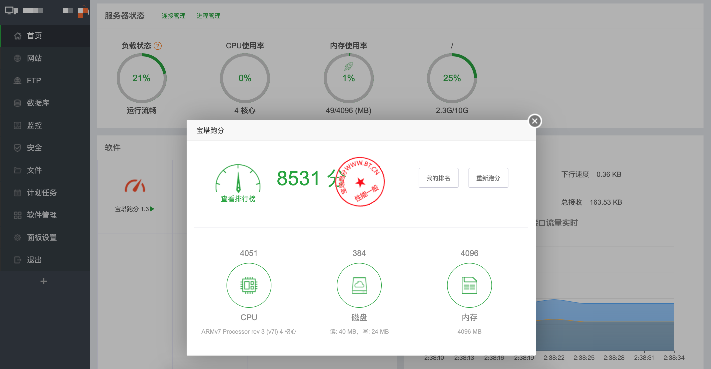
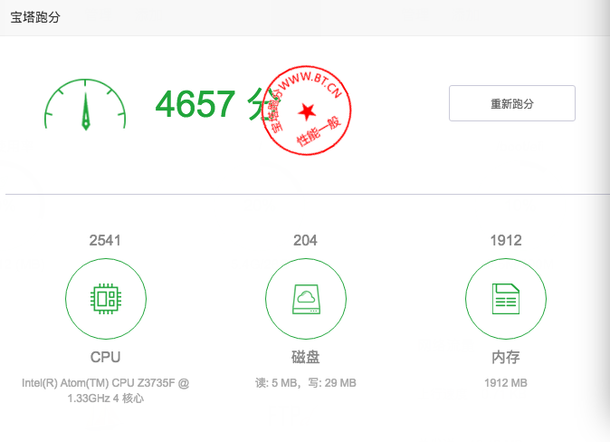

&nbsp;&nbsp;&nbsp;&nbsp;

# Debian Pi Aarch64 - 基础系统 + 深度桌面 + Xfce桌面

**[OPENFANS开源社区](http://www.openfans.org)&nbsp;&nbsp; && &nbsp;&nbsp;[树莓派爱好者基地](http://www.pifan.org/)&nbsp;&nbsp;荣誉出品**

###  再次重申！我们是团队，企业级的专业团队出品的系统，不要拿个人作品来和我们比较

----

# 宝塔虚拟机 安装及使用说明

* **在使用宝塔虚拟机之前，请确认你使用的是我们的Debian-Pi-Aarch64系统**

* **并已安装和配置好了我们最新的 QEMU虚拟机二进制软件包 [点击查看](../qemu-kvm.md)**

然后即可前往下面的地址下载**宝塔虚拟机镜像**

----

#### 下载地址：

[点击前往](https://pan.baidu.com/s/1cQRDNV712f7sbrFrP4wpQg)

----

#### 文件路径：

**Debian-Pi-Aarch64-PKGS** -> **qemu_vm** -> **bt_panel_vm** -> **5.9.1_pro**

-> **bt-panel_vm_5.9.1_pro.tar**

----

### 使用方法：

上传文件到你的服务器，然后解压文件

执行命令：

    tar xvf bt-panel_vm_5.9.1_pro.tar

可以得到以下文件

    bt-panel_vm_5.9.1_pro/
    bt-panel_vm_5.9.1_pro/install
    bt-panel_vm_5.9.1_pro/bt.qcow2.disk.xz
    bt-panel_vm_5.9.1_pro/kernel.tar
    
进入文件夹， bt-panel_vm_5.9.1_pro

    cd  ./bt-panel_vm_5.9.1_pro

然后执行安装命令

    ./install

可以看到如下提示：

    kernel/
    kernel/vmlinuz-4.9.0-8-armmp-lpae
    kernel/initrd.img-4.9.0-8-armmp-lpae
    unzip your vm disk image, you will wait for a while...

    Done!

执行查看命令

    ls -al

可以看到如下文件：

    total 8069616
    drwxr-xr-x 3 root root       4096 Jan 20 08:44 .
    drwxr-xr-x 4 pi   sudo       4096 Jan 20 08:28 ..
    -rwxr-xr-x 1 root root        195 Jan 20 08:44 bt_prog
    -rw-r--r-- 1 root root 7094861824 Jan  9 00:28 bt.qcow2.disk
    -rw-r--r-- 1 root root 1324182196 Jan  9 00:28 bt.qcow2.disk.xz
    -rwxr-xr-x 1 root root       1085 Jan 20 08:44 bt_run
    -rwxr-xr-x 1 root root       2527 Jan  9 00:42 install
    drwxr-xr-x 2 root root       4096 Jan  6 21:57 kernel
    -rw-r--r-- 1 root root   20387840 Jan  9 00:26 kernel.tar
    -rw-r--r-- 1 root root         32 Jan 20 08:38 ports

至此，宝塔虚拟机已安装成功

----

### 启动宝塔虚拟机

进入宝塔虚拟机目录执行以下命令

    ./bt_run

### 关闭虚拟机

请ssh登录到虚拟机再执行命令 " **init 0** " 关闭虚拟机

- 关闭后，需要在宝塔虚拟机目录下执行 " **./bt_prog** " 命令，检查虚拟机是否已关闭

- **如果没有任何输出结果，代表虚拟机已正常关闭**

- 如果无法正常关闭虚拟机，请在宝塔虚拟机目录下执行 " **./bt_prog  kill** " 命令

- 同样记得再次执行 " **./bt_prog** " 命令，检查虚拟机是否已关闭

### 开机自启动

执行如下命令

    ./install int

### 默认参数值

|项目|内容|
|---|---|
|默认管理端口|28888|
|默认管理地址|http://你树莓派的IP地址:28888/|
|默认Web管理用户及密码|openfans/openfans|
|宝塔虚拟机ssh端口|2222|
|宝塔虚拟机root默认密码|rapberry|

### 如何ssh连接到宝塔虚拟机

- 本机连接： *ssh -p 2222 root@localhost*

- 外部连接： *ssh -p 2222 root@你树莓派的IP地址*

### 注意:

- 除非你懂得修改 *install* 部署脚本，否则不要修改宝塔面板默认的管理端口

- 如果你需要开启自定端口的站点支持，请编辑 *ports*文件 加入你自定义的端口，但不要修改 *ports* 文件里其他默认的端口

## 其他说明

由于树莓派的性能有限，我们只是为了方便和节约大家时间，默认一次性开启了宝塔的所有功能

请各位根据自身情况有选择的关闭和保留宝塔的相关功能模块

## 如何扩展虚拟机的磁盘大小

[点击此处](./resize_vmdisk.md) 查看相关文档 
