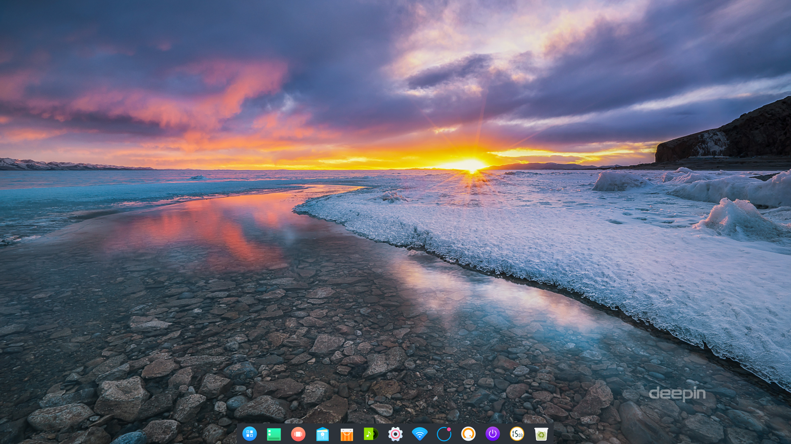
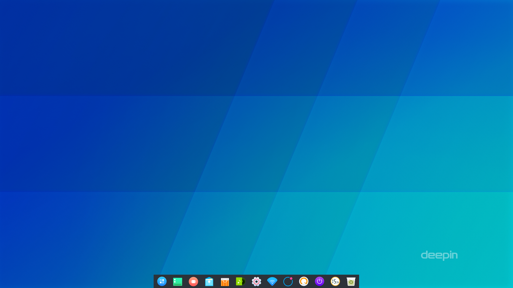
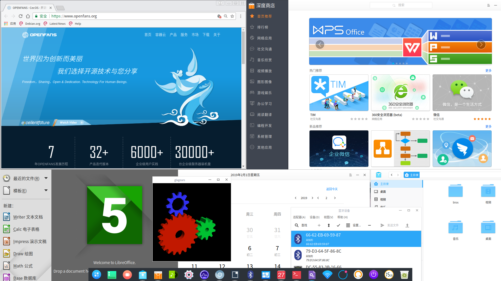
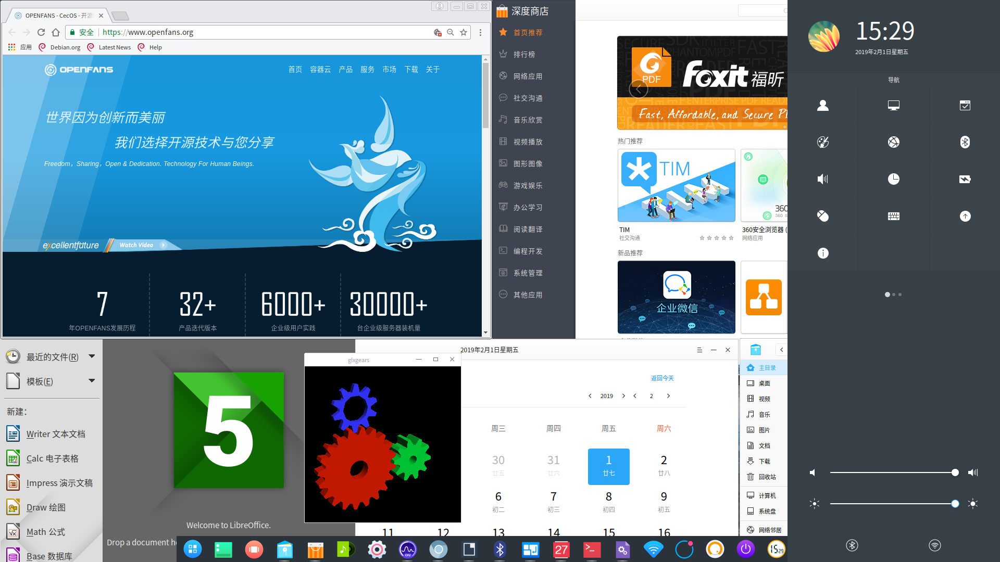
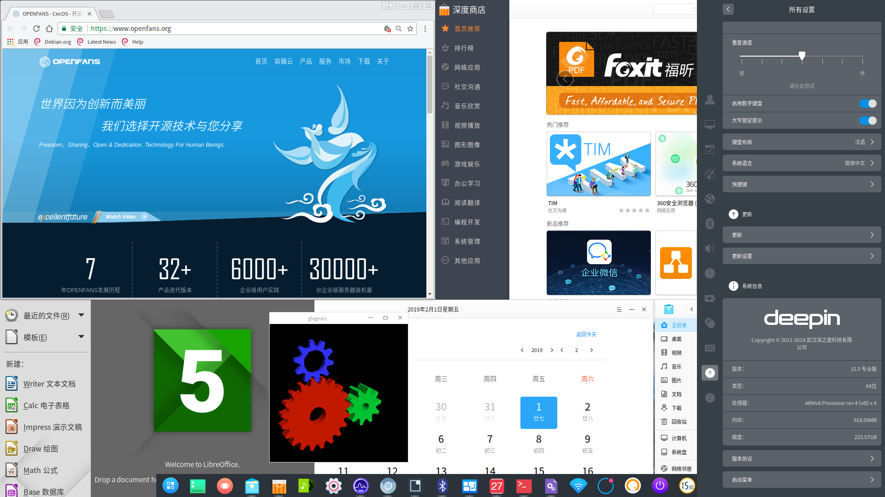
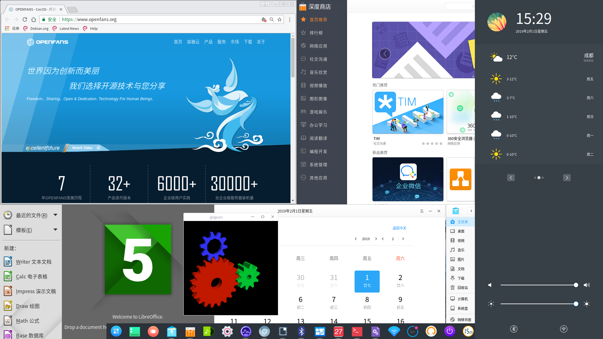
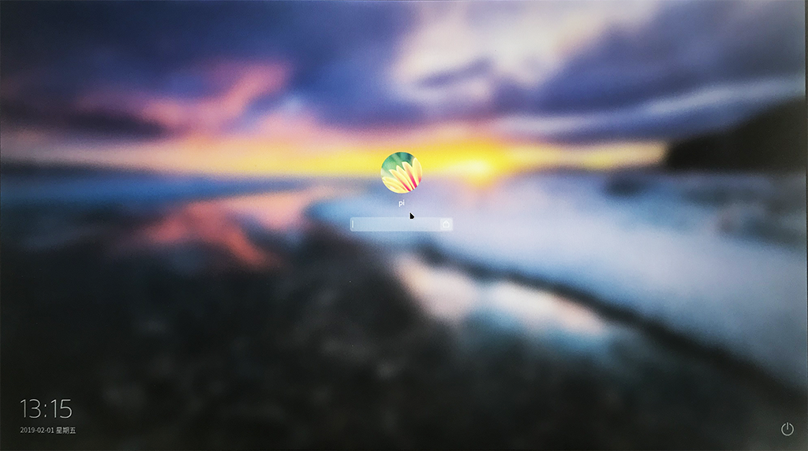
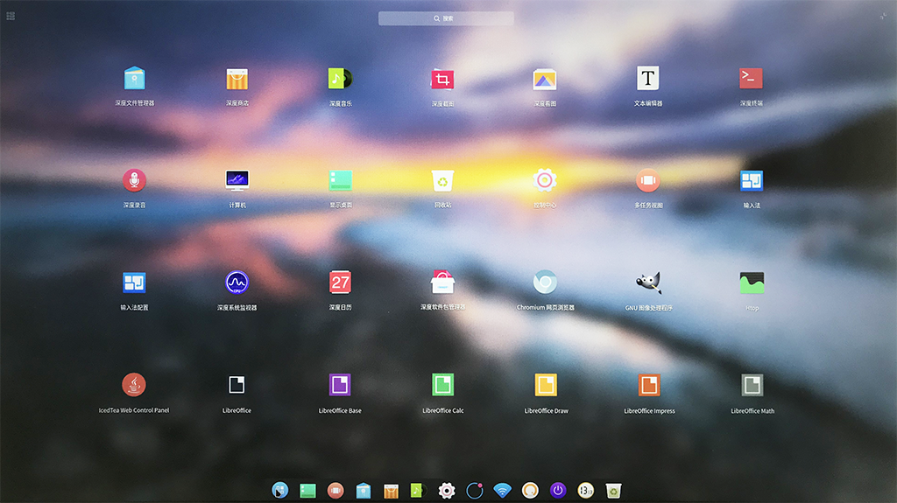
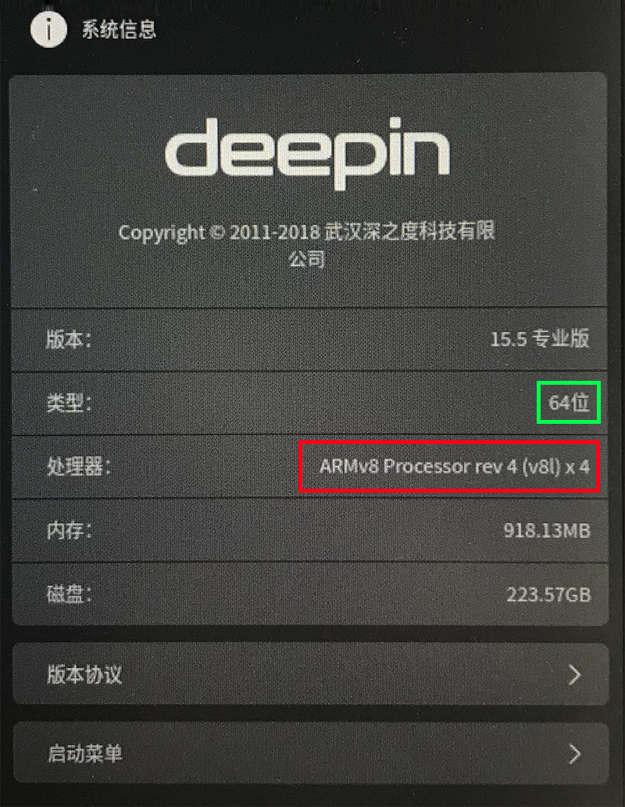
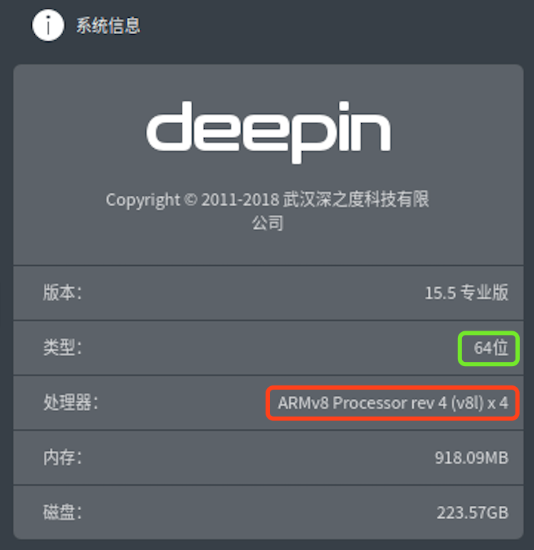

# 深度桌面 Deepin Aarch64 ARM64位 专业版

**全网首发！！**

## 系统介绍

大名鼎鼎的深度Deepin这里就不做过多介绍了，目前网上只有古老的32位树莓派2B的镜像，没有支持3B/3B+的镜像，就更别奢望Aarch64 ARM64位的树莓派3B/3B+的镜像支持了... 

现在，OPENFANS基于自己的基础系统U4版镜像，移植了完整的【 深度Deepin 15.5 专业版 】桌面

目前已正式发布，并提供下载，这是目前第一个基于完整的*Debian Aarch64*架构而构建的适配于**树莓派B/3B+/3A**的**64位深度ARM64桌面系统镜像** ！

## 系统特点

1. 完全兼容 **[OPENFANS Debian Pi Aarch64](https://github.com/openfans-community-offical/Debian-Pi-Aarch64)** 系统，具备 **OPENFANS Debian Pi Aarch64** 系统的所有优秀特性

2. 完全支持 **OPENFANS Debian Pi Aarch64** 系统的所有配置和操作指令

3. 得益于强大的 **OPENFANS Debian Pi Aarch64** 的底层支持，我们在U4版的基础系统之上对内核进行了魔改，极大的提高了内存压缩和使用效率 [\*1]

4. 在U4版的基础系统之上，我们从内核和驱动上强化了GPU驱动的图形性能，以满足深度重型桌面环境对图形化性能的强劲需求 [\*2]

5. 因为深度桌面环境属于重型桌面环境，对CPU、GPU、内存都有一定的要求，我们通过 **[\*1]**和**[\*2]** 的工作，不仅让树莓派运行ARM64位深度桌面成为可能，更具备了优秀的图形和视屏处理能力，即使是谷歌浏览器这样的大型浏览器，也能轻松实现在线视频的流畅播放（点击[此处](./deepin.md#%E6%92%AD%E6%94%BE%E8%A7%86%E9%A2%91)查看播放视频的文件）

6. 和**OPENFANS Debian Pi Aarch64**一样，深度ARM64桌面系统镜像使用UEFI启动，完整支持有线、网卡和蓝牙设备，均可以通过图形界面配置

7. 支持 **shellinabox** Web方式进行SSH访问，使用方法同**OPENFANS Debian Pi Aarch64**一致

8. 默认使用成熟的**EXT4**文件系统

9. 同**OPENFANS Debian Pi Aarch64**共享软件源和更新

10. 支持TF卡和USB外设的多启动

## 截图

#### 系统桌面

#### 系统面板

#### 登录窗口

#### DashBoard

- 关键硬件信息

#### 系统桌面版本

#### 播放视频

系统浏览器播放视频演示1 [下载](../videos/deep_show_1.mp4) | [在线播放](https://v.qq.com/x/page/n08348fdlcr.html)

系统浏览器播放视频演示2 [下载](../videos/deep_show_2.mp4)
