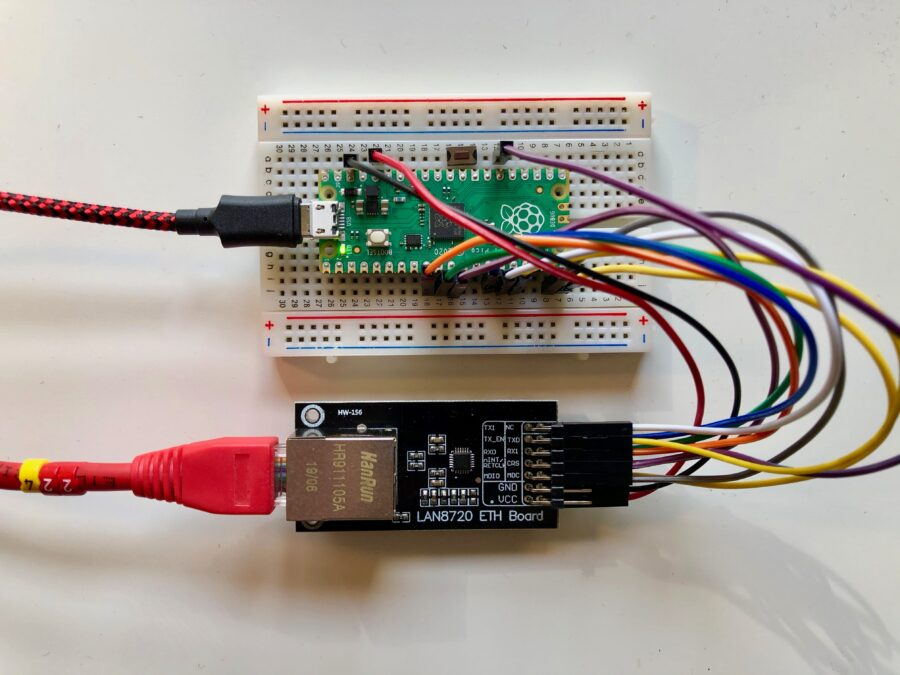
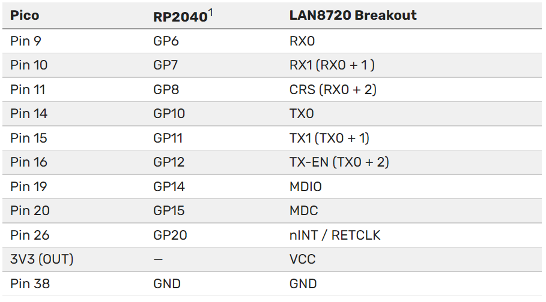

## USER ROOT

```
apt install libusb-dev libusb-1.0-0-dev pkg-config -y
wget -O pico_setup.sh https://rptl.io/pico-setup-script
chmod +x pico_setup.sh
sudo ./pico_setup.sh  (when script running: wget https://aka.ms/linux-arm64-deb; mv pico/linux-arm64-deb )

cat /root/.bashrc | grep PICO
export PICO_SDK_PATH=/root/pico/pico-sdk
export PICO_EXAMPLES_PATH=/root/pico/pico-examples
export PICO_EXTRAS_PATH=/root/pico/pico-extras
export PICO_PLAYGROUND_PATH=/root/pico/pico-playground

source 
git clone https://github.com/sandeepmistry/pico-rmii-ethernet
cd pico-rmii-ethernet/
git submodule update --init
mkdir build
cd build
cmake ..
make -j4
```





If everything goes well you should have a UF2 file in build/examples/httpd called **pico_rmii_ethernet_httpd.uf2** . You can now load this **UF2** file onto your Pico in the normal way.

TTL console to your pico.
Then open up a browser window and type the IP address that your router has assigned to your Pico into the address bar, if everything goes well you should see the default lwIP index page.

#### Changing the web pages

It turns out to be pretty easy to change the web pages served by Pico. You can find the “**file system**” with the default lwIP pages inside the HTTP application in the lwIP Git submodule.

```
cd pico-rmii-ethernet/lib/lwip/src/apps/http/fs
ls 
404.html   img/        index.html
```

You should modify the **index.html** file in situ here with your favourite editor. Afterwards we’ll need to move the file system directory into place, and then we can repackage it up using the associated **makefsdata** script.

```
cd ..
mv fs makefsdata 
cd makefsdata
perl makefsdata
```

Running this script will create an **fsdata.c** file in the current directory. You need to move this file up to the parent directory and then rebuild the UF2 file.

```
mv fsdata.c ..
cd ../../../../../..
rm -rf build
mkdir build
cd build
cmake ..
make
```

If everything goes well you should have a new UF2 file in **build/examples/httpd** called **pico_rmii_ethernet_httpd.uf2** , and you can again load this UF2 file onto your Pico as before.

On restart, wait till your Pico grabs an IP address again and then, opening up a browser window again and typing the IP address assigned to your Pico into the address bar, you should now see an updated web page.

You can go back and edit the page served from your Pico, and build an entire site. Remember that you’ll need to rebuild the **fsdata.c** file each time before your rebuild your UF2.

#### Current limitations

There are a couple of limitations on the current implementation. The RP2040 is running underclocked to just 50MHz using the RMII modules’ reference clock, while the lwIP stack is compiled with NO_SYS so neither the Netcon API nor the Socket API is enabled. Finally, link speed is set to 10 Mbps as there is currently an issue with TX at 100 Mbps.

