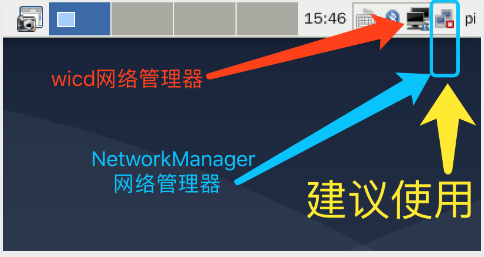
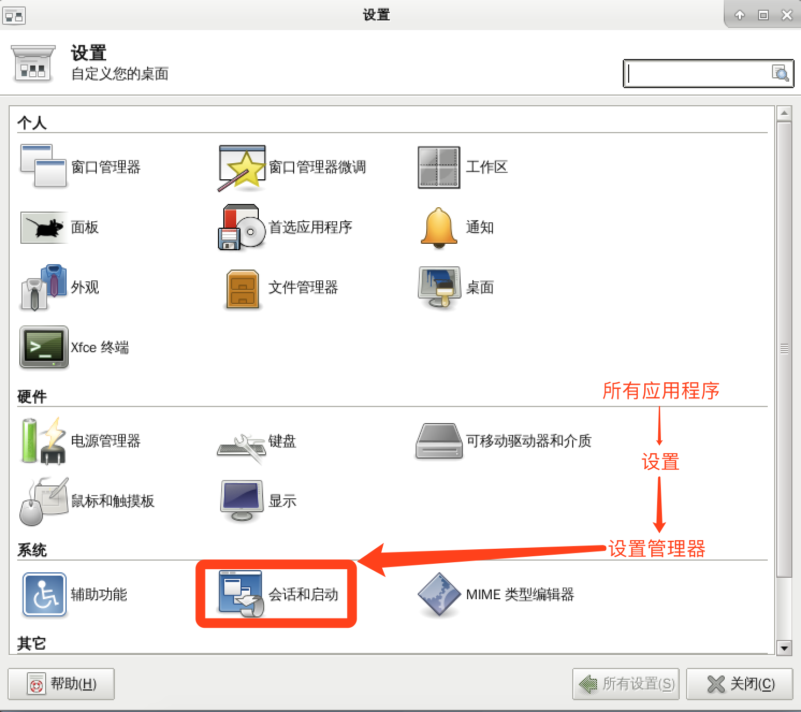
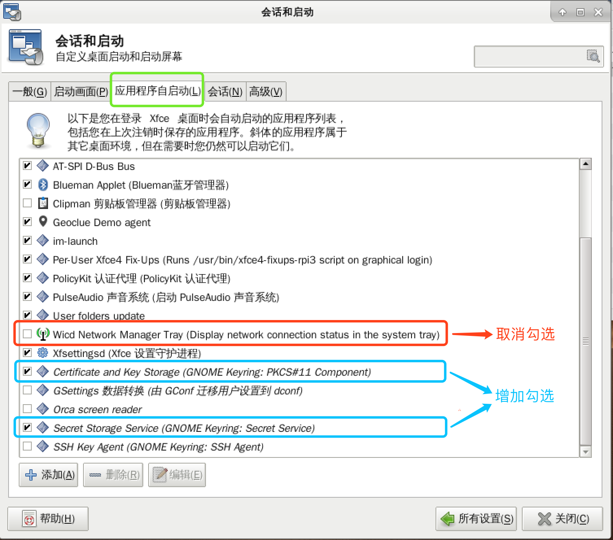
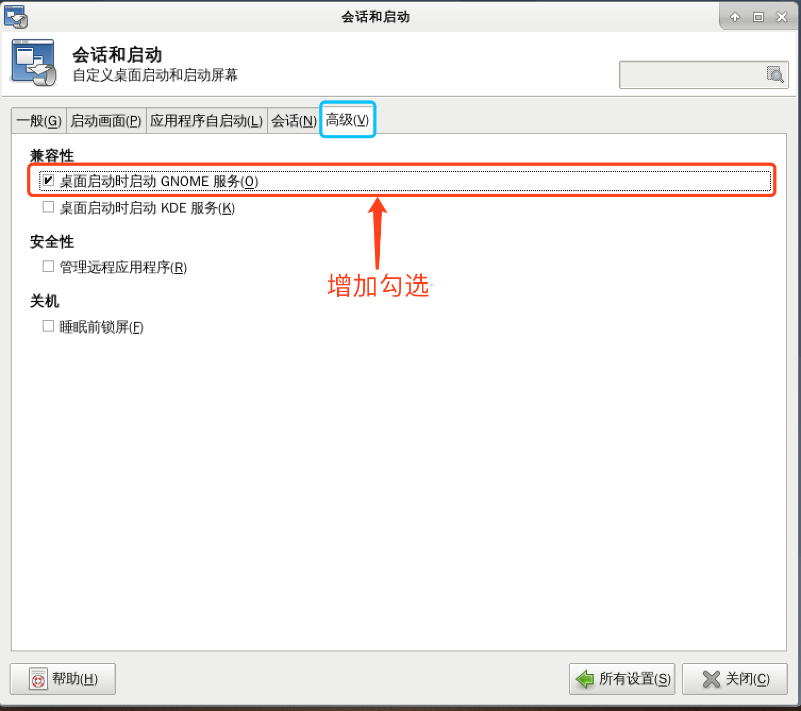

# 已作废

## Debian-Pi-Aarch64 Xfce桌面  Wifi无线设置问题 ~~解决办法~~ 

~~## 已知问题：~~

~~客户端兼容性问题，即使输入正确的密码也 **无法连接到无线网络**~~

~~## 问题根源：~~

~~GNOME-KEYRING未启用，必要时需要开机自动启用~~

~~## 图形化解决方案：~~

~~- 如下图所示：右上角有2个无线管理程序，从 **最右边往左** 依次是 **"NetworkManager"** 和 **"Wicd"**~~

~~为了保证无线的兼容性，所以我们集成了多个无线管理工具，这里我们强烈推荐使用 **"NetworkManager"**~~

~~~~

~~- 然后我们来进行**GNOME-KEYRING**的相关设置~~

~~点击屏幕最左上方，选择 **"所有应用程序"** -> **"设置"** -> **"设置管理器"** ，~~

~~在弹出的 **"设置"** 窗口选择 **"会话和启动"** 如下图所示：~~

~~~~

~~打开 **"会话和启动"** 设置后，选择 **"应用程序自启动"** 选项~~

~~取消勾选 **"Wicd Network Manager Tray"**~~

~~勾选 **"Certificate and Key Storage (GNOME Keyring: PKCS#11 Componet)"**~~

~~勾选 **"Secret Storage Service (GNOME Keyring: Secret Service)"**~~

~~如下图所示：~~

~~~~

~~- 接下来在 **"会话和启动窗口"** 选择 **"高级"** 选项~~

~~在兼容性部分，勾选 **"桌面启动时启动GNOME服务"** ，如下图所示：~~

~~~~

~~- 最后重启系统，然后再使用 桌面右上角的 **"NetworkManager"** 管理器连接到你的无线网络~~

~~## 终极解决办法：~~

~~直接修改无线配置文件（参考无线设置部分的说明）点击[此处](../README.md#%E7%BD%91%E7%BB%9C%E9%A2%84%E9%85%8D%E7%BD%AE)查看~~
