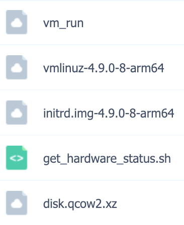

# QEMU-KVM 下载及使用说明

## 下载地址

* QEMU虚拟机二进制软件包 [下载地址](https://pan.baidu.com/s/1cQRDNV712f7sbrFrP4wpQg)

      文件路径：Debian-Pi-Aarch64-PKGS -> qemu

      文件名：qemu-2.12+dfsg-3.zip

* Debian Aarch64虚拟机镜像 [下载地址](https://pan.baidu.com/s/1cQRDNV712f7sbrFrP4wpQg)

      文件路径：Debian-Pi-Aarch64-PKGS -> qemu_vm -> debian9_vm

      此文件夹下的所有文件均需要下载，如下图所示：

&nbsp;&nbsp;&nbsp;&nbsp;&nbsp;&nbsp;&nbsp;&nbsp;

## 使用说明

### **QEMU虚拟机二进制软件包 使用说明**

1. 下载QEMU虚拟机二进制软件包
2. 上传到你的树莓派
3. 解压压缩包
4. 进入解压文件目录，然后执行以下命令安装即可

```shell
sudo sh ./install
```

*注意：你的系统必须要能够连接互联网，安装过程中需要下载相关依赖的软件包*

### **Debian Aarch64 虚拟机镜像 使用说明**

1. 登录到你的树莓派并新建一个文件夹，例如 *virtual_michine*
2. 将刚才下载的所有文件全部上传到这个目录中
3. 进入刚才新建的这个目录，如 *virtual_michine*，执行以下命令解压虚拟机镜像文件

```shell
sudo xz -k -d disk.qcow2.xz
```

4. 解压镜像需要一定的时间，完成后在这个新建的目录下执行以下操作以**前台**的方式启动并运行虚拟机

复制一份 **vm_run** 文件，并将及命名 为 **vm_run2**

编辑这个复制的文件 **vm_run2**，去掉文件末尾的 **“ & ”** 符号，保存文件并退出编辑

然后执行以下命令以**前台**的方式启动虚拟机

```shell
sudo sh ./vm_run2
```

5. 登录虚拟机并开启远程登录

按照以上步骤启动虚拟机后，登录系统，默认账户的**root**的密码为：**raspberry**

编辑 **/etc/ssh/sshd_config** 文件

找到有 “**PermitRootLogin**” 这一行的内容，去掉前面的 **"#"** 注释符号，并将这行内容改为以下内容

```shell      
PermitRootLogin yes
```       

保存文件并退出文件编辑，然后执行以下命令

```shell 
systemctl damon-reload ; systemctl restart ssh
```

最后执行以下命令，关闭虚拟机

```shell 
init 0
```

5. 以**后台**方式运行虚拟机

完成上述步骤后，现在我们让虚拟机以后台的方式运行

执行以下命令，以**后台**的方式访问虚拟机：

```shell
sudo sh ./vm_run2
```

6. 远程登录

该虚拟机的 **22** 号端口已默认映射到了本机的 **2222** 号端口，**SSH**访问本机的**2222**端口即可

参考命令：

```shell
ssh -p 2222 root@本机的IP地址
```
